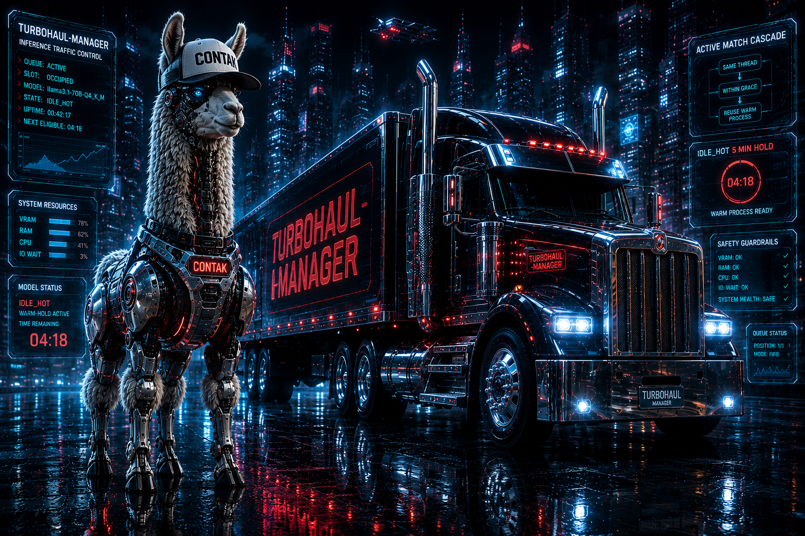

# Turbohaul-Manager

Ollama-shape inference manager using [Tom's TurboQuant](https://github.com/TheTom/llama-cpp-turboquant) fork of llama.cpp.

FIFO queue + grace + IDLE_HOT hot-hold + model swap on Nvidia RTX GPU's including Blackwell.

## What it does

- Accepts OpenAI / Ollama-shape `/v1/chat/completions` requests
- Single-slot serial sidecar (one llama-server child holds the model)
- ACTIVE_MATCH cascade for same-thread follow-ups within a grace window (warm-process reuse)
- IDLE_HOT 5-minute warm-hold after grace expires: same-model follow-ups inherit the warm process; different-model swap tears down + spawns new
- Safety guardrails: refuses spawn when VRAM / RAM / CPU / IO-wait would put the host at risk

## Quick start

```bash
# Run the CUDA variant (Blackwell or older NVIDIA GPU)
docker run --gpus all -p 11401:11401 \
    -v $(pwd)/state:/var/lib/turbohaul \
    -v $(pwd)/models:/var/lib/turbohaul/import-staging \
    ghcr.io/MrTrenchTrucker/turbohaul-manager:v0.2.1  # not yet published

# Or build locally
git clone https://github.com/MrTrenchTrucker/turbohaul-manager.git
cd turbohaul-manager
docker build -f Dockerfile.cuda -t turbohaul-manager:v0.2.1 .
```

## API

Compatible with Ollama-shape clients:

- `GET /api/tags` -- list models
- `GET /api/show?name=<tag>` -- model detail
- `POST /v1/chat/completions` -- OpenAI-shape inference
- `POST /api/chat` -- Ollama-shape inference
- `PUT /api/manifests/{tag}` -- register a new model (requires GGUF blob in store)
- `POST /api/pull-hf` -- pull a GGUF from HuggingFace
- `POST /api/pull-url` -- pull a GGUF from arbitrary HTTPS URL (SSRF-guarded)
- `POST /api/import` -- import a local GGUF file
- `GET /status` -- live queue + active + idle_hot snapshot

## Setting up AI Agents

Pointing an AI agent (Hermes, langchain, llama-index, LiteLLM, raw OpenAI SDK, Ollama clients, etc.) at Turbohaul is two lines:

```yaml
base_url: http://<turbohaul-host>:11401/v1
api_key: dummy # no auth required on the fleet-internal port
```

Turbohaul ships with sane defaults for multi-tool-call agent loops — `idle_hot_load_seconds=600`, `grace_seconds=30`, streaming SSE pass-through, tool-call field forwarding, and ACTIVE_MATCH warm-slot reuse for same-`thread_id` follow-ups (sub-second after the first turn).

**Full guide:** [docs/AI_AGENT_SETUP.md](docs/AI_AGENT_SETUP.md) — per-agent config recipes (Hermes / OpenAI SDK / langchain / llama-index / LiteLLM / Ollama / curl), multi-tool-call workflow notes, production setup, validation smoke tests, and a troubleshooting table.

## Development

```bash
pip install -e ".[dev]"   # backend deps + pre-commit
npm install               # frontend + oxc tooling (workspace root)
pre-commit install        # auto-format + lint on every commit

pytest                    # backend test suite
npm run build             # frontend production build
npm run dev               # frontend dev server
```

CI (`.github/workflows/ci.yml`) runs three parallel jobs on every PR:

- `backend-lint` — `ruff format --check` + `ruff check`
- `backend-tests` — `pytest` on py3.11 and py3.12
- `frontend` — `oxfmt --check` + `oxlint` + `tsc --noEmit` + `vite build`

## License

MIT (see LICENSE). All third-party deps audited MIT-compatible (see THIRD_PARTY_NOTICES.md).

## Contributors

See [CONTRIBUTORS.md](CONTRIBUTORS.md). MrTrench (founder) shipped v0.2.1.
