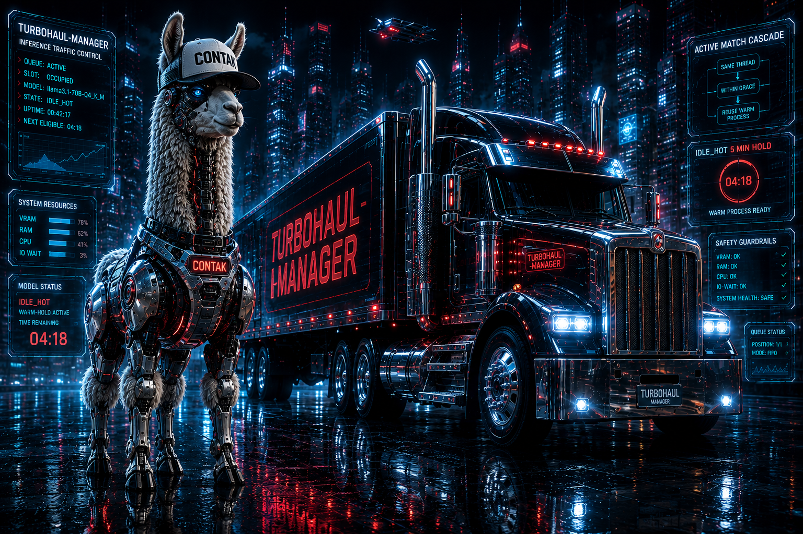
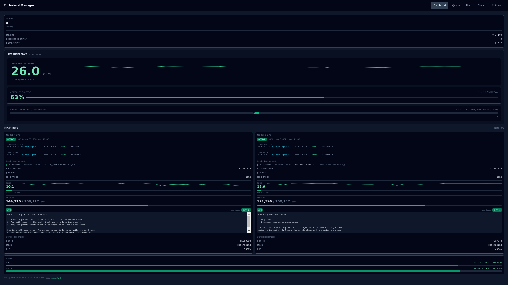
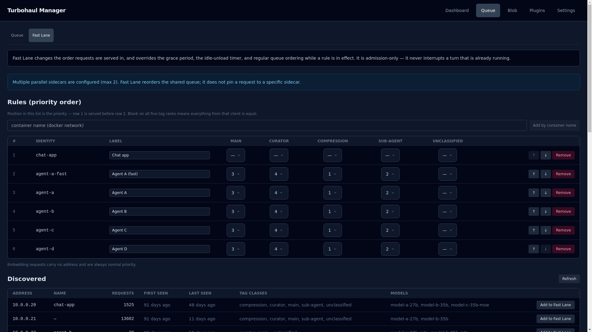

<p align="center">
  
</p>

# Turbohaul-Manager

**One GPU, a whole fleet of AI agents.** Turbohaul-Manager is a self-hosted inference server for local GGUF models on NVIDIA GPUs (Blackwell included). It speaks the Ollama and OpenAI APIs, queues every agent's requests on one card, and keeps each conversation's work warm. A follow-up turn picks up where the last one left off instead of making the model re-read the whole conversation.

**Why it matters:** a large context that takes about 327 s to re-read comes back in about 0.5 s. In one measured restore after a full unload, 154,647 tokens were reused with only 29 new tokens to process.

- 🚦 **Fast Lane:** decide which clients, and which kinds of work, get served first. Off by default.
- ♻️ **Warm conversations:** each conversation's computed context (its KV cache) is saved and restored across pauses, model swaps and idle unloads.
- 🔌 **Drop-in API:** any Ollama or OpenAI client connects with two lines of config.
- 🚛 **Many agents, one card:** requests queue cleanly, the warm model is kept when it can be, and several models can stay loaded at once (`max_parallel_sidecars`).
- 📊 **Web dashboard:** watch what is loaded, running and queued, and manage models, manifests and the blob store from the browser.
- 🛡️ **Safety first:** refuses to load a model when VRAM, RAM, CPU or disk wait would put the host at risk.
- 📦 **Fully vendored:** the engine (a [TurboQuant](https://github.com/TheTom/llama-cpp-turboquant) fork of llama.cpp), the Python wheels and the web UI live in this one repository.



## Quick start

Turbohaul is built from source; no prebuilt image is published.

```bash
git clone https://github.com/MrTrenchTrucker/turbohaul-manager.git
cd turbohaul-manager
docker build -f Dockerfile.engine-src -t turbohaul-manager:v0.8.0 .

docker run --gpus all -p 127.0.0.1:11401:11401 \
    -v $(pwd)/state:/var/lib/turbohaul \
    -v $(pwd)/models:/var/lib/turbohaul/import-staging \
    turbohaul-manager:v0.8.0
```

Then open **http://127.0.0.1:11401/ui**.

- ⚠️ **No built-in login.** Turbohaul performs no authentication, so the bind address is the security boundary. Keep `127.0.0.1` unless you have read [Security model & hardening](ARCHITECTURE.md).
- 💾 **Keep the `state` mount.** It holds the database, the manifests and the model blobs. Without it they are lost when the container is removed. See [docs/PERSISTENCE_CHECKLIST.md](docs/PERSISTENCE_CHECKLIST.md).
- 🖥️ **Hardware:** three tiers (Minimum, Recommended, High) are in [SYSTEM_REQUIREMENTS.md](SYSTEM_REQUIREMENTS.md).
- 🧰 **Build options:** `Dockerfile.engine-src` builds fully offline from the vendored sources for CUDA architectures 89 and 120 (add `--build-arg CUDA_ARCH="<list>"` to change them). `Dockerfile.cuda-multi` covers Turing through Blackwell, but installs the Python and frontend dependencies from the network.

## Connect your agent

Point any OpenAI-compatible client (an AI harness, an agent framework, the OpenAI SDK, an Ollama client) at Turbohaul:

```yaml
base_url: http://<turbohaul-host>:11401/v1
api_key: dummy   # no authentication is performed
```

The defaults are tuned for multi-tool-call agent loops: streaming pass-through, tool-call forwarding on both APIs, recovery of tool calls a model writes as plain text, and warm reuse for same-thread follow-ups.

- **Full guide:** [docs/AI_AGENT_SETUP.md](docs/AI_AGENT_SETUP.md)
- **Agent skills** (for an AI agent that sets up or runs Turbohaul for you): [skills/](skills/)

## MLX backend (macOS / Apple Silicon)

Turbohaul can run models two ways, chosen per model in the manifest with the
`backend` field:

- `llama.cpp` (default) — the TurboQuant `llama-server` binary. Works on Linux
  with a GPU, or on macOS using Metal. Needs a GGUF file.
- `mlx` — **Apple Silicon only.** Runs `python -m mlx_lm server` (the MLX
  framework), so the model runs natively on the Mac's GPU/Neural Engine with no
  CUDA and no Docker image. No GGUF file needed.

**Any MLX model works — nothing is hardcoded.** You tell Turbohaul which model to
use in the manifest; it does not ship or assume any particular model. Point it at:

- `model_repo` — a Hugging Face MLX model id (e.g. `mlx-community/Qwen3-1.7B-4B`), or
- `model_path` — a local folder with the model files already on disk.

If you set neither, the manifest is rejected with a clear error. This works with the
Qwen family (Qwen2.5 / Qwen3, Instruct and base, 4-bit and 8-bit MLX builds),
Llama, Mistral, Phi, Gemma — anything `mlx_lm` can load.

MLX is **Apple Silicon + macOS only**. On any other machine an `mlx` manifest
refuses to start (clear error), while `llama.cpp` manifests keep working as before.

How it fits in: `mlx_lm server` already speaks the same OpenAI-style API
(`/health` + `/v1/chat/completions`) that Turbohaul uses for llama.cpp, so health
checks and completion need no MLX-specific code. Any extra `mlx_server_flags` you
set are checked against a fixed allowlist (`SAFE_MLX_FLAGS` in
`src/turbohaul/mlx_spawn.py`) before they reach the command line, so a manifest
can't inject arbitrary flags.

Register a model — example: Qwen3 1.7B pulled from the Hugging Face hub:

```bash
curl -s -X PUT http://localhost:11401/api/manifests/qwen3-1.7b \
  -H "Content-Type: application/json" \
  -d '{
    "model_tag": "qwen3-1.7b",
    "backend": "mlx",
    "model_repo": "mlx-community/Qwen3-1.7B-4B",
    "mlx_server_flags": { "max_tokens": 4096, "use_default_chat_template": true }
  }'
```

Other ways to point at a model:

```jsonc
// A larger Qwen pulled from the hub:
{ "backend": "mlx", "model_repo": "mlx-community/Qwen3-8B-4bit" }

// A model you already have on disk (no download):
{ "backend": "mlx", "model_path": "/Volumes/Models/mlx-community/Qwen3-1.7B-4B" }

// Speculative decoding for more speed (draft + target both MLX):
{ "backend": "mlx", "model_repo": "mlx-community/Qwen3-1.7B-4B",
  "mlx_server_flags": { "draft_model": "mlx-community/Qwen3-0.6B-4bit",
                        "num_draft_tokens": 4 } }
```

Install on the Mac:

```bash
pip install -e ".[mlx]"        # adds mlx-lm to Turbohaul's environment
# or, if mlx-lm is already available (e.g. via oMLX):
conda install -c conda-forge mlx-lm
```

The macOS helper script is `turbohaul-launcher.sh`.

### Web UI (no Docker needed)

Turbohaul serves its own dashboard from the same port at **`/ui`** — there is
no separate container or service to run. A built frontend bundle is committed
to the repo at `src/frontend/dist`, and `ui.static_path` defaults to it
automatically, so the UI works out of the box on a source checkout or
`pip install -e .`:

- Open **http://localhost:11401/ui** after starting Turbohaul.
- No `ui.static_path` entry is needed in your `turbohaul.yaml`; the default
  resolves to the bundled `src/frontend/dist`.

If you'd rather rebuild the UI from source (e.g. after editing it):

```bash
cd src/frontend
npm install
npm run build            # outputs src/frontend/dist
# or live-dev with hot reload on Vite's own port (default :5173):
npm run dev
```

To disable the UI, set `ui.enabled: false` in `turbohaul.yaml`. (In the Docker
image the bundle is copied to `/opt/turbohaul/ui_dist` and that path is set
automatically — you don't need to touch it.)

## 🚦 Fast Lane: deciding who goes next


When several agents share one GPU, somebody has to go first. By default requests are served in arrival order. Fast Lane lets you say it should be *this* client, and *this* kind of work (main conversation, curator, compression, sub-agent), ahead of the rest.

- **It never interrupts a reply.** It only chooses which waiting request goes next. A lower-priority idle model may be unloaded to make room, but only between turns.
- **Nobody starves.** Unlisted traffic has a wall-clock fairness floor (`fastlane.max_normal_wait_s`).
- **Easy to set up:** turn it on at **Settings → General → Fast Lane**, then pick clients from the **Discovered** list at **Queue → Fast Lane**.



Full guide: [docs/FAST_LANE.md](docs/FAST_LANE.md)

## More under the hood

- **Several models, or several copies of one:** `max_parallel_sidecars` sets how many engines run box-wide, and `llama_server_flags.parallel` sets context windows per engine. See [docs/SIDECARS_AND_CONTEXT_WINDOWS.md](docs/SIDECARS_AND_CONTEXT_WINDOWS.md).
- **Multi-GPU placement:** assign models to cards explicitly or automatically. See [docs/MULTI_GPU_PLACEMENT.md](docs/MULTI_GPU_PLACEMENT.md).
- **Hybrid (SSM + attention) models** are sized correctly from their real dimensions. See [docs/HYBRID_KV_RATIO.md](docs/HYBRID_KV_RATIO.md).
- **Vision models and speculative decoding**, configured per model. See [docs/VISION_MODELS.md](docs/VISION_MODELS.md) and [docs/SPECULATIVE_DECODING.md](docs/SPECULATIVE_DECODING.md).
- **Tool-call recovery** for models that write their tool calls as text. See [docs/TOOL_CALL_HANDLING.md](docs/TOOL_CALL_HANDLING.md).
- **Plugins** *(work in progress):* operator-run HTTP services (a transcriber, a document converter) invoked through the API. See [docs/PLUGINS_SETUP.md](docs/PLUGINS_SETUP.md).

## 📚 Documentation

| I want to... | Read |
|---|---|
| Understand how it all fits together | [ARCHITECTURE.md](ARCHITECTURE.md) |
| See every API endpoint | [docs/API_REFERENCE.md](docs/API_REFERENCE.md) |
| Use the web dashboard | [docs/frontend/README.md](docs/frontend/README.md) |
| Connect an AI agent | [docs/AI_AGENT_SETUP.md](docs/AI_AGENT_SETUP.md) · [skills/](skills/) |
| Set up Fast Lane | [docs/FAST_LANE.md](docs/FAST_LANE.md) |
| Add and configure a model (backend and dashboard) | [docs/MODELS_AND_MANIFESTS.md](docs/MODELS_AND_MANIFESTS.md) |
| Look up every manifest field and flag | [docs/MODEL_CONFIG_REFERENCE.md](docs/MODEL_CONFIG_REFERENCE.md) · [docs/TURBOQUANT_FLAGS.md](docs/TURBOQUANT_FLAGS.md) |
| Understand cache reuse | [docs/KV_CACHE_MATCHING.md](docs/KV_CACHE_MATCHING.md) · [docs/REASONING_KV_REUSE.md](docs/REASONING_KV_REUSE.md) · [docs/KV_CACHE_RAM_LIFECYCLE.md](docs/KV_CACHE_RAM_LIFECYCLE.md) |
| Plan GPUs and memory | [SYSTEM_REQUIREMENTS.md](SYSTEM_REQUIREMENTS.md) · [docs/SAFETY_GATE_VRAM_MATH.md](docs/SAFETY_GATE_VRAM_MATH.md) · [docs/MULTI_GPU_PLACEMENT.md](docs/MULTI_GPU_PLACEMENT.md) |
| Share one GPU between many agents | [docs/MULTI_AGENT_SHARING.md](docs/MULTI_AGENT_SHARING.md) · [docs/DEPLOYMENT_PATTERNS.md](docs/DEPLOYMENT_PATTERNS.md) |
| Run it in production | [docs/PERSISTENCE_CHECKLIST.md](docs/PERSISTENCE_CHECKLIST.md) |
| Add plugins *(WIP)* | [docs/PLUGINS_SETUP.md](docs/PLUGINS_SETUP.md) · [docs/PLUGIN_REFERENCE.md](docs/PLUGIN_REFERENCE.md) |
| See what changed | [CHANGELOG.md](CHANGELOG.md) |

## Known issues

- 💾 **Saving the KV cache to disk when a model unloads is a work in progress and does not currently work.** The RAM tier works, so cache reuse across model swaps is unaffected.
- ⬆️ **Upgrading from v0.7.0?** One retired setting stops the manager from starting until you remove it. Read the *Compatibility* notes in [CHANGELOG.md](CHANGELOG.md) before you restart.

## Contributing, credits and license

- **Contributing:** [CONTRIBUTING.md](CONTRIBUTING.md)
- **Contributors:** [CONTRIBUTORS.md](CONTRIBUTORS.md)
- **License:** MIT (see [LICENSE](LICENSE)). Third-party dependencies are listed in [THIRD_PARTY_NOTICES.md](THIRD_PARTY_NOTICES.md), all under MIT or MIT-compatible permissive licenses.
