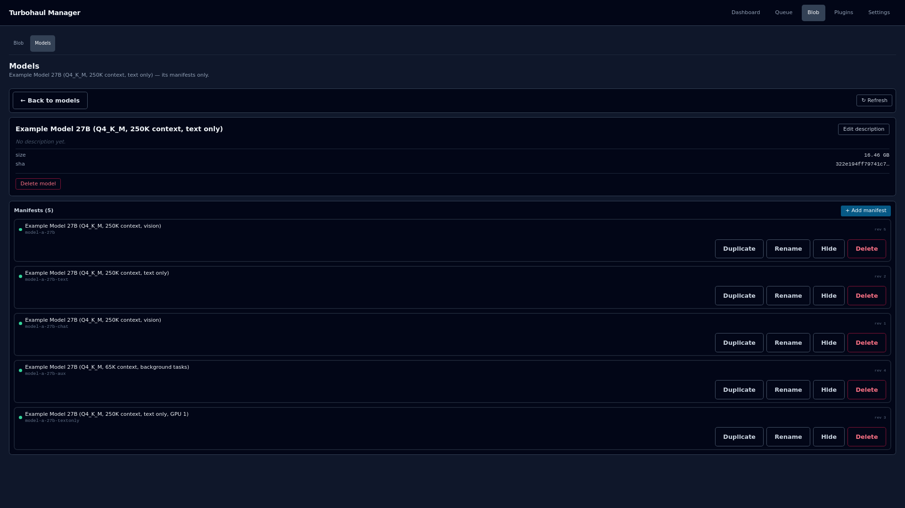
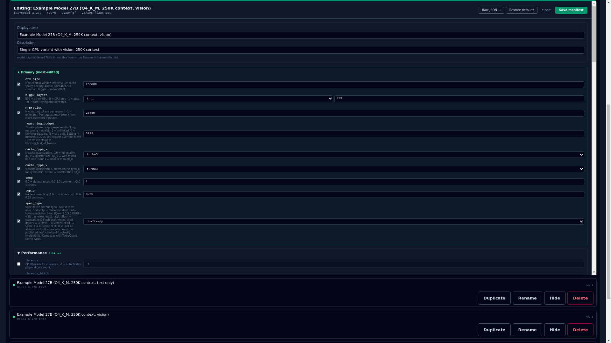

# Models and manifests

**A model file is not yet a model you can call.** To run one you do two things: get the file into the blob store, then write a manifest that tells Turbohaul-Manager how to run it. You can do both from the API, or from the dashboard.

- A **blob** is the model file, stored under the hash of its contents (its sha256). Two identical files are one blob.
- A **manifest** is one YAML file per model tag. It points at a blob and carries the settings: the tag, the context size, the VRAM it expects and the `llama-server` flags.
- A **model**, to a client, is a manifest's tag. Agents call it by that tag, and `/v1/models` and `/api/tags` list it.

```
 1  get the file in             2  describe how to run it            3  use it
┌─────────────────────┐   ┌───────────────────────────┐   ┌──────────────────────────┐
│ pull or import      │──▶│ manifest, one YAML per    │──▶│ call the model by its    │
│ into the blob store │   │ tag: blob digest, sizes,  │   │ tag; it is staged and an │
│ (sha256 identity)   │   │ llama_server_flags        │   │ engine is spawned        │
└─────────────────────┘   └───────────────────────────┘   └──────────────────────────┘
```

| Step | On the backend | In the dashboard (`/ui`) |
|---|---|---|
| **1. Get the file in** | `POST /api/pull-hf`, `POST /api/pull-url` or `POST /api/import` | Blob tab, **Blob** page, **Pull model** (URL, HuggingFace or Local import) |
| **2. Write the manifest** | `PUT /api/manifests/{tag}`, or a `<model_tag>.yaml` file in the manifests folder | Blob tab, **Models** page: open the model's tile, then **+ Add manifest** |
| **3. Check it** | `GET /api/manifests/{tag}`, `GET /v1/models` | The tile on the **Models** page, the row on the **Blob** page |
| **Remove it** | `DELETE /api/manifests/{tag}`, then `DELETE /api/delete` for the blob | **Delete** on the manifest, then **Delete model** |

The full list of fields and flags is in [MODEL_CONFIG_REFERENCE.md](MODEL_CONFIG_REFERENCE.md). This guide is the way in; it links there instead of copying it.

---

## The pieces

**Blob.** The model file itself, stored under the hash of its contents. A blob is not a model you can run: it becomes runnable when a manifest points at it and supplies the settings. Size on disk is not the memory it will need, because the context cache is charged on top.

**Manifest.** One YAML file per model at `<manifests_path>/<model_tag>.yaml` (`/var/lib/turbohaul/manifests/` in the shipped config). The schema is closed: any unknown top-level key is rejected, not ignored. One blob can back several manifests, which is how you run the same weights with different context sizes, placement or roles without a second copy on disk.

**Tag.** The manifest's `model_tag` is its name and its filename stem. It must match `^[a-z0-9][a-z0-9._-]{0,63}$`: lowercase ASCII, 1 to 64 characters, starting with a letter or digit. A manifest with `hidden: true` is left out of `/v1/models` and `/api/tags` but still serves when a request names its exact tag.

---

## Add a model on the backend

### 1. Put the file in the blob store

| Route | Use it for | Notes |
|---|---|---|
| `POST /api/pull-hf` | A GGUF from HuggingFace | The host must be on `pull.hf_host_allowlist` |
| `POST /api/pull-url` | A GGUF from an HTTPS URL | `https` only; the download is SSRF-guarded |
| `POST /api/import` | A GGUF already on the machine | An absolute path under the configured import root |

Pass `expected_sha256` to a pull and the download is checked against it. An import takes the file's path and replies with the blob's `sha256`:

```bash
curl -X POST http://<manager>/api/import \
  -H 'Content-Type: application/json' \
  -d '{"path":"/var/lib/turbohaul/import-staging/<subdir>/<model>.gguf"}'
# -> {"sha256":"<MODEL_BLOB>", ...}
```

`GET /api/blobs` lists what is in the store. The digest you need for the manifest is the blob's sha256.

### 2. Write the manifest

Only `model_tag` and `gguf_blob_sha256` are required. This is a trimmed version of the first worked example in [MODEL_CONFIG_REFERENCE.md](MODEL_CONFIG_REFERENCE.md) (Section 12):

```yaml
model_tag: my-model-27b
gguf_blob_sha256: <64 lowercase hex characters>
context_size: 16384
expected_vram_bytes: 21500000000
llama_server_flags:
  ctx_size: 16384
  n_gpu_layers: 999
```

- **Create** with `PUT /api/manifests/{tag}`, or put the file in the manifests folder. A new manifest needs no `If-Match`.
- **Update** with the same route: `GET` the manifest, read its `ETag`, edit, then `PUT` with `If-Match` set to that value. The server writes atomically and returns the next revision. A missing or stale `If-Match` on an existing manifest returns 412 and nothing is overwritten.
- The digest is checked for shape only: 64 lowercase hex characters (an uppercase digest is rejected). A manifest that names a blob not yet in the store is accepted, and the missing blob shows up when the model is spawned.

### 3. The settings you will touch first

| Field | What it does |
|---|---|
| `display_name`, `description` | Free-text labels shown in the UI; cosmetic |
| `gguf_blob_sha256` | Ties the manifest to an exact GGUF in the store |
| `gguf_size_bytes` | The declared blob size; the KV-fit estimate uses it as the model body (0 skips that estimate) |
| `context_size` | The model's declared context length; **not** the same as the `ctx_size` flag (see below) |
| `expected_vram_bytes` | The footprint the VRAM gate checks before a spawn (default 0) |
| `hidden` | Leaves the tag out of the discovery listings |
| `auto_place` | With `split_mode: none`, lets the manager pick the least-loaded card |
| `prompt_template` | `{system_default, stop_tokens}`: a default system prompt and stop strings |
| `llama_server_flags` | The engine flags (next section) |

Two traps to know:

- **`context_size` is not `ctx_size`.** The top-level `context_size` is model metadata. `llama_server_flags.ctx_size` is what is passed to `llama-server` as `--ctx-size`. They are usually set to the same number, but nothing makes them agree, so change both when you tune context length.
- **`expected_vram_bytes` at 0 removes that model's own term from the VRAM gate.** The gate then falls back to the box-wide minimum-free-VRAM floor and the KV-fit estimate. Set a real value for the gate to protect you. With expert offload (`cpu_moe`, or `n_cpu_moe` above 0) and `expected_vram_bytes` above 0, the measured value replaces the closed-form estimate, so it must already include the KV cache.

### 4. Engine flags (`llama_server_flags`)

`llama_server_flags` is a **closed allowlist**: a flag that is not on it is rejected with `not in the closed allowlist`, and path-, URL- and credential-bearing flags are denied outright. Adding a flag is a code change, not a YAML edit.

- **Start from the five recommended flags:** `flash_attn`, `no_context_shift`, `cache_reuse: 256`, `slot_prompt_similarity: 0.5` and `no_perf`. They are not injected automatically. Add `jinja: true` for tool-call work.
- **KV cache types.** `cache_type_k` and `cache_type_v` are where TurboQuant is dialed in per model (the default is `turbo3`). See [TURBOQUANT_FLAGS.md](TURBOQUANT_FLAGS.md).
- **`parallel` above 1 needs `kv_unified: true`**, or the manifest is rejected at load. `parallel` is the number of concurrent context windows inside one engine; see [SIDECARS_AND_CONTEXT_WINDOWS.md](SIDECARS_AND_CONTEXT_WINDOWS.md).
- **`sleep_idle_seconds`** sets how long the model stays loaded after its last request when the client sends no `keep_alive` (`-1` pins it to 1800 s; `0` uses `queue.idle_hot_load_seconds`).
- **Hybrid models** (`arch`, `hybrid_kv_ratio`, `kv_bytes_per_token`): [HYBRID_KV_RATIO.md](HYBRID_KV_RATIO.md).
- **Vision models.** `mmproj_blob_sha256` names the projector by hash; empty means text-only. See [VISION_MODELS.md](VISION_MODELS.md). The structured editor in the dashboard does not show this field; use Raw JSON.
- **Speculative decoding.** `spec_type` and, for `draft-dflash` or `draft-dspark`, `spec_draft_gguf_blob_sha256`. See [SPECULATIVE_DECODING.md](SPECULATIVE_DECODING.md).

For every flag, its type and bound, see Appendix A of [MODEL_CONFIG_REFERENCE.md](MODEL_CONFIG_REFERENCE.md); for complete example manifests, see its Section 12.

### 5. When a change takes effect

The manifest is read the next time the model is staged, so no restart is needed. But the flags are passed to `llama-server` when its process is spawned. A `PUT` does not change a model that is already loaded: the old command line stays until the process exits and is spawned again. To pick up a change you can:

- send a request for that tag with `"keep_alive": 0`, so the engine is torn down at the end of that request;
- wait for the model's idle window to end; or
- restart the container.

---

## Add a model in the dashboard

The dashboard serves from the same port at `/ui`. Models live under the **Blob** tab, which has two pages: **Blob** and **Models**. Nothing there is authenticated; the bind address is the boundary.

### 1. Pull the file (Blob page)

Below the table, **Pull model** brings a file into the store from one of three sources:

| Source | Fields |
|---|---|
| **URL** | An https URL, an optional expected sha256, and an optional tag |
| **HuggingFace** | A repo (`owner/repo`), a file in the repo, and an optional tag. The host must be on `pull.hf_host_allowlist`. **Known issue:** this form currently fails with a 400; use the **URL** form with the file's direct `https` link, or `POST /api/pull-hf` |
| **Local import** | An absolute path under the configured import root, and an optional tag |

The server's HTTP status and reply appear below the button, and the list refreshes after a successful pull. The **Installed models** table has one row per manifest that is not hidden: its name, size on disk, parameter count, type (dense or MoE), modality, the start of its digest and when it was last modified.

### 2. Configure it (Models page)



Each tile is one model file: its display name, description, how many manifests point at it, its size and the start of its hash.

- A tile reading **"No manifests yet — click to add the first one"** is a model file with no configuration: present, but not runnable.
- Click a tile to open the model's page, which lists its manifests. **+ Add manifest** asks for a new tag and creates a manifest for that file.
- Each manifest row has four buttons:

| Button | What it does |
|---|---|
| **Duplicate** | Creates a copy of the manifest, tagged `<tag>-copy` |
| **Rename** | Creates the manifest under the new tag and deletes the old one; callers using the old name get a 404 |
| **Hide** / **Show** | Hides the model from the discovery listings, or shows it again; a hidden model still serves requests that name it exactly |
| **Delete** | Deletes the manifest |

- Click a manifest row to open its editor: a display name, a description, and the engine flags grouped by category with the most-edited first. **Save manifest** writes the change, **Restore defaults** clears the model's cache overrides back to the defaults, and **Raw JSON** edits the manifest as text. The raw mode skips the form but not the server's validation.


- The form mirrors the server's own allow-list of engine flags exactly. If a flag is not on that list the server would refuse it, and the form does not offer it.
- Edits take effect the next time the model is staged; no restart is required (see "When a change takes effect" above for a model that is already loaded).

A model description is stored against the blob digest, so it survives renaming or duplicating a manifest; a manifest description is stored with the manifest. **"Unnamed model"** only means no manifest for that file has a display name, which is cosmetic.

### 3. Remove a model

**Delete** on the Blob page asks for confirmation and refuses while any manifest still points at the blob, and it tells you which ones. A manifest counts whether it names the blob as its model, its vision projector or its speculative draft model. Delete or re-point the manifests first, then delete the blob. On a model's page, **Delete model** offers **Delete blob + N manifests** (the one that succeeds) or **Delete blob, keep manifests** (refused while any manifest still names the file).

---

## When something does not work

| What you see | Why, and what to do |
|---|---|
| The manifest is rejected for its digest | `gguf_blob_sha256` must be exactly 64 lowercase hex characters; lowercase a pasted digest |
| `not in the closed allowlist` | That flag is not an accepted flag; adding one is a code change |
| `parallel` above 1 is rejected | Add `kv_unified: true` |
| A saved change does nothing | The model is already loaded and keeps its old command line; use one of the three ways in "When a change takes effect" |
| Deleting a blob returns 409 | A manifest still names it as its model, projector or draft model; delete or re-point those manifests first |
| A valid manifest is refused at load | The memory gates can refuse a valid manifest; see [SAFETY_GATE_VRAM_MATH.md](SAFETY_GATE_VRAM_MATH.md) |
| The **HuggingFace** pull form returns 400 | Known issue in this release: the form sends the wrong field names. Use the **URL** form with the file's direct `https` link, or `POST /api/pull-hf` with `repo_id` and `filename` |
| The old name returns 404 after a rename | **Rename** creates the manifest under the new tag and deletes the old one |
| A model file shows no manifests | A file with no manifest is present but not runnable; add one |

## Where to go next

- [MODEL_CONFIG_REFERENCE.md](MODEL_CONFIG_REFERENCE.md): every manifest field and flag, with examples.
- [API_REFERENCE.md](API_REFERENCE.md): the routes used above.
- [frontend/04-blob.md](frontend/04-blob.md) and [frontend/05-models.md](frontend/05-models.md): the two dashboard pages in full.
- [ARCHITECTURE.md](../ARCHITECTURE.md), sections 9.1 and 9.2: how manifests fit into the system, and plugin manifests (work in progress).
- [TURBOQUANT_FLAGS.md](TURBOQUANT_FLAGS.md): the recommended TurboQuant flag set for new manifests, and how to verify and apply it.
