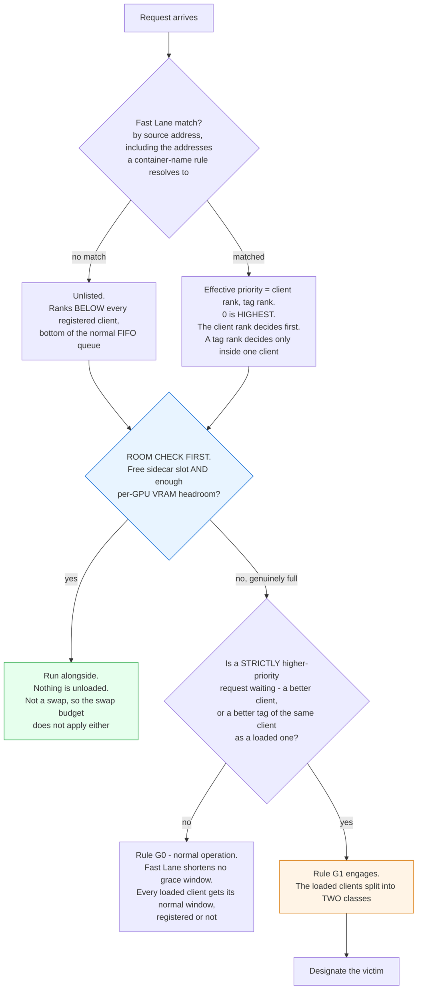
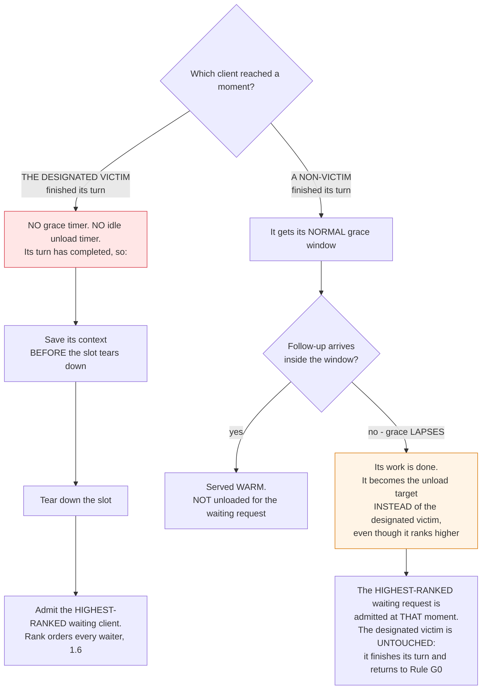
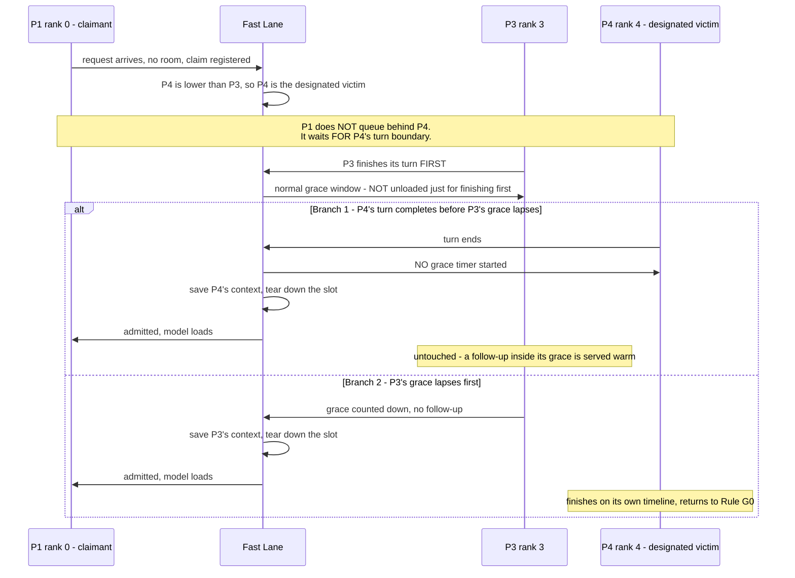
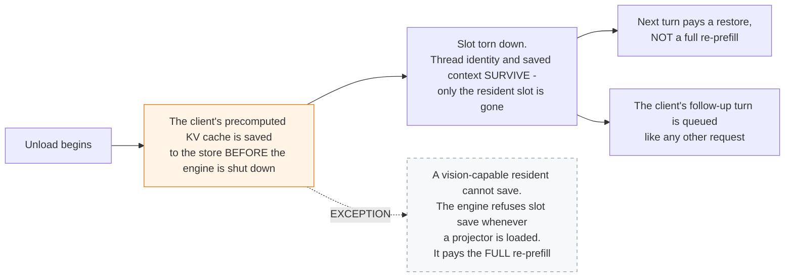
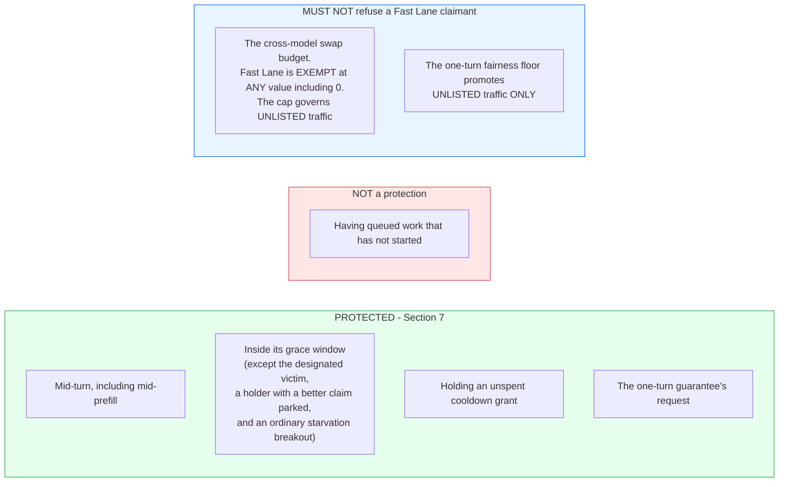
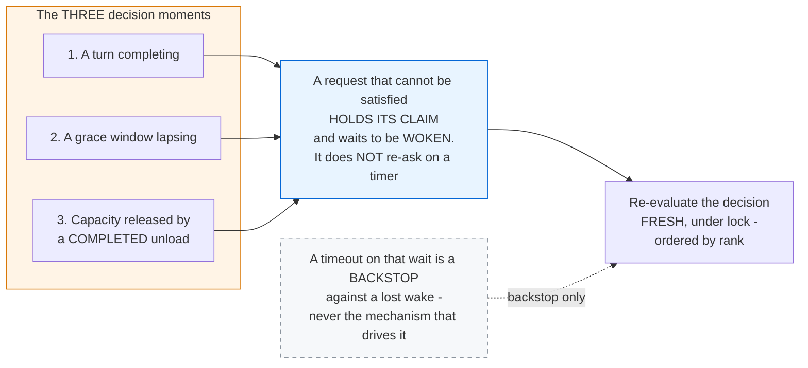

# Fast Lane: Priority Admission and Turn-Boundary Eviction

**Which Fast Lane doc do you want?** This is the architecture doc for Fast Lane: how it behaves, the specification. Setup and day-to-day use: [docs/FAST_LANE.md](../FAST_LANE.md). The dashboard page: [docs/frontend/03-fast-lane.md](../frontend/03-fast-lane.md).

**Status:** This document specifies Fast Lane as the code implements it. The diagrams restate the
text; where a figure and the text disagree, the text governs. Fast Lane is off by default
(`fastlane.enabled` is `false`). For setup and day-to-day operation see
[docs/FAST_LANE.md](../FAST_LANE.md); this document specifies behaviour.

---

## 1. What Fast Lane is

Fast Lane lets an operator designate up to **10 clients**, each by IP address or, for a client on the
same Docker network, by container name, and give them a numeric priority that outranks everyone else.
Chat requests carry their source IP in the request metadata, and the manager keeps a census of which
address requested which model, so "who is who" is already known. A container-name rule is resolved
forward, in the background, to the container's current addresses; a name that has never resolved, or
whose latest lookup failed, matches nothing, so a lookup failure leaves a client unlisted instead of
promoting it by mistake. Clients that are off the Docker network are known by address only. Rules, tag
ranks and the other Fast Lane settings are runtime configuration: they apply to the next request and
survive a restart. The census of observed addresses is rebuilt from the state database at boot.

### 1.1 Priority admission and turn-boundary eviction

Fast Lane is non-preemptive priority scheduling. It **never interrupts, cancels or unloads a request
that is generating**. It does two things, and both happen only between turns:

1. **Priority admission.** It decides which *waiting* request is admitted next. A request's priority is
   stamped once, when the request is admitted to the queue. The order among waiting requests is
   recomputed at every pick, and the winner is removed only from the waiting buffers, never from a
   running slot.
2. **Turn-boundary eviction.** When the server is full, it unloads a resident model to make room for a
   higher-priority request. The model is an *idle* resident, or the *designated victim* at the moment
   its turn ends, or a holder whose grace window has lapsed. The resident's context is saved first when
   that is possible (Section 4). In this document "eviction" always means unloading a model, never
   cancelling a request.

The word "preemption" is therefore not used for this feature: in scheduling it means interrupting a
running task, which Fast Lane never does. "Admission-only" is too narrow, because Fast Lane also
unloads idle models and ends the designated victim's grace window. The code that enforces this is:

- In `src/turbohaul/manager.py`, `_resident_has_running_turn`, `_idle_unload_candidates` and
  `_lru_idle_unloadable` define the unload candidates. A resident with an active slot or in-flight
  requests is never a candidate, and the fallback arm for the designated victim also skips running
  turns.
- The driver loop tears the designated victim down only after `_serve_on_resident` has returned and the
  resident's active slot is cleared, by calling `_begin_unload_locked`.
- `src/turbohaul/fastlane.py` is a pure matcher and `src/turbohaul/fastlane_resolve.py` a pure
  resolver; neither can cancel anything. The only `.cancel()` calls in `manager.py` are cleanup of
  fan-out tasks, driver failure and shutdown.
- `src/turbohaul/queue.py` reads the stamped priority in `_fastlane_priority_key` and never writes it.

### 1.2 Priority scale

Ranks are `0` through `9`, and **`0` is the highest priority**. A client's rank is the position of its
rule in the ordered rule list (the rule index), and a request matches the first rule whose address set
contains its source address. **Any client not registered in Fast Lane ranks below all registered
clients, at the bottom of the normal FIFO queue.**

### 1.3 Per-tag ranks and effective priority

Within a registered client, each request class can carry its own rank, which orders that client's own
traffic against itself (for example, interactive turns ahead of the background work they spawn). The
classes come from the caller's own labels (`is_main`, `is_sub_agent`, `is_curator`,
`is_compression`), read through one function so that a request carrying several labels resolves to
exactly one class; a curator wins over compression, compression over sub-agent, and sub-agent over
main. The five ranked tags are `main`, `curator`, `compression`, `sub_agent` and `unclassified`, which
is the tag for any request with no dedicated class. Tag ranks run from `1` to `5`, lower is served
first, and a tag with no rank orders after that client's ranked tags.

**See also:** [docs/TAGS_AND_IDENTITY.md](../TAGS_AND_IDENTITY.md) — how a caller sends the labels these classes come from.

**Effective priority is `(client rank, tag rank)`, compared in that order.** The client rank decides
first. The tag rank matters only between two requests, or between a request and a resident, of the
**same** client, so a tag rank never moves a client above or below another client. Wherever this
document orders requests or residents by "rank" or "priority", it means effective priority.

- **Pick stage.** A same-thread follow-up (a grace-window continuation) does not jump a waiting request
  of the same client whose tag is strictly better, including a request parked in the inbox of the busy
  resident. With equal tags nothing changes and the follow-up takes the warm path. A request that is
  already running is never affected.
- **Choosing which model to unload.** A claim carrying a better tag outranks a resident of the same
  client that holds a worse tag, under the same gates as between clients: the resident is unloaded only
  at its own turn boundary (Rule G1 and Section 7), other residents keep their grace (Rule G4), the
  choice is made afresh under the lock (Rule G5), the resident's context is saved first when it can be
  (Section 4), and the eviction cooldown (5.3) and the swap-budget exemption (5.4) apply as they do
  between clients.
- **Order among one client's residents.** The resident with the worse-ranked tag is unloaded first.
  Recency breaks a tie only between residents of the same client with the same tag rank. A resident's
  tag is the tag of its latest turn, and a follow-up served inside the grace window updates it.
- **One claim per (client, model).** A Fast-Lane-matched request registers a claim when it lands in the
  queue or when it cannot get room. The claim
  always carries the priority of the best request of that client for that model that is still waiting;
  a strictly better later request takes it over. When the request it points at starts, is cancelled,
  disconnects or fails, the claim moves to the next best waiter, or is released if none remains. A claim
  that is not parked in a resident's inbox expires after 1800 seconds, and the registry holds at most
  100 claims, dropping the lowest-priority one when it is full.

### 1.4 Room check comes first

Eviction is never used when it is not needed. If there is a free sidecar slot (under
`queue.max_parallel_sidecars`) and enough per-GPU VRAM headroom for the arriving model, the request runs
alongside what is already loaded and nothing is unloaded. Memory held by idle residents counts as room
for this purpose: the server is not full while unloading the idle residents of one card would make room
for the arriving model on that card (1.5.5).

### 1.5 Placement and card selection

Placement decides which card a model runs on. It determines which residents are eligible for unloading,
so it is part of this specification. See [docs/MULTI_GPU_PLACEMENT.md](../MULTI_GPU_PLACEMENT.md) for
the general placement model.

**1.5.1 A manifest may select a card.** A model manifest may name the card it runs on (the `main_gpu`
flag). This remains valid; 1.5.4 states the regime in which it is superseded.

**1.5.2 The victim set is global for an outranking claim.** A live claim that strictly outranks the
lowest-priority idle resident on the machine may unload it even when it sits on another card than the
one the arriving model is assigned to. A claim that does not outrank it is confined to the arriving
model's own card.

**1.5.3 The claimant may be relocated.** Freeing memory on one card does not create room on another.
When a claim of a pinned model can only be satisfied by unloading a resident on a different card, the
claimant is relocated to that card. For an auto-placed model the placer picks the card again on the
retry.

**1.5.4 With the lane enabled, placement is chosen, not inherited.** While Fast Lane is on, the card for
a model whose manifest sets `split_mode` to `none` (one card) is chosen from the machine's live free
VRAM at the moment the model is admitted, whether or not a claim is in play, and the manifest's
`auto_place` flag cannot veto it. The card with the most free VRAM that still keeps
`queue.safety_min_free_vram_mib` free is used. The manifest's card selection governs when the lane is
off and whenever no card can be chosen.

**1.5.5 Idle memory is reclaimed before a model is split.** When the card for such a model is chosen at
admission (under 1.5.4, or, while the lane is off, for a manifest with `auto_place`), the choice runs in
this order:

1. A card that already has room is used, and nothing is unloaded.
2. If no card has room, the memory of each card's idle residents is counted as free. A resident is idle
   when it is past its grace window, has no turn running, is not loading, holds no unspent cooldown
   grant (5.3) and is not itself split across cards. If one card then holds the model and its context
   with the safety margin still free, the model goes on that card and the idle residents there are
   unloaded first, each with its context saved when the engine and the client allow it (Section 4).
3. Only if no single card has room even then may the model be split across cards.

When several cards qualify at step 2, each card is judged by the most protected resident it would have
to unload, and the card whose unload reaches the least protected clients is chosen (unlisted clients
before listed ones, then a higher rank number before a lower, then, within one client, the worse tag
before the better). A card that needs nothing more unloaded, for example because an unload already
under way covers it, ranks first. Between cards of equal rank, the one that needs the least memory
unloaded is chosen (an unload already under way counts once), then the one with the most headroom, then
the lowest card number. On the chosen card, residents are unloaded in the usual order; how recently a
resident was used orders residents within a card but never compares cards. A card is chosen
only if every other card still keeps its safety margin after the CUDA context the model leaves on it
(1300 MiB) and after memory promised to models still loading. The decision is taken again on every retry
and dropped once it no longer holds. A manifest that is itself split across
cards is never moved onto one card, and a manifest pinned to a card while the lane is off keeps its
card.

> **Limit.** While any model split across cards is loaded, the admission check refuses every card to a
> single-card model, so this rule does not run: the arriving model waits, because an idle split model is
> unloaded through the ordinary make-room path and one that is mid-turn is never cut.

### 1.6 Requests queued behind an unloaded model keep their rank

The priority scale orders **every** admission decision, including the one that follows an unload. A
request that was queued behind a model that has been unloaded is re-queued and ordered by its effective
priority like any other request; it neither inherits a position from before nor loses one. Among
waiting requests, a lower-ranked client is not picked ahead of a higher-ranked client, even when the slot
that just freed is the one nearest to it. There are two stated exceptions: a same-thread follow-up inside
its grace window is served warm without going through the picker (Rule G1), and the one-turn guarantee
(5.2) promotes an unlisted request.

Only requests that are queued but have not started are re-queued: the unstarted requests in the
unloaded resident's inbox go back to the head of the queue, or to the tail when the resident was the
designated victim. A request whose slot cannot be re-enqueued has its future failed rather than
dropped. That happens when the queue is closing at shutdown and, for the tail re-queue of a designated
victim's backlog, when the staging buffer is already full (that path has no accept-buffer fallback), so
that client receives an error without having disconnected. Otherwise a queued request stays queued until
its client disconnects, however many times it is deferred; the eviction cooldown (5.3) bounds how quickly
one client can be unloaded again, not how long its queued work keeps being retried.

---

**Figure 1: the top-level gate, does anything get unloaded at all? (Sections 1.2 to 1.4)**

## 2. The grace rules

A resident that finishes a turn enters a **grace window** (`queue.grace_seconds`, default 30 s) in which
a same-thread follow-up is served warm. When the window lapses the resident becomes idle-evictable and
may be unloaded by any make-room pass, in priority order, until its idle hold
(`queue.idle_hot_load_seconds`, default 600 s) ends. The rules below say when Fast Lane changes this.

**Rule G0: normal operation (no higher-priority claim waiting).** When a loaded client's turn
completes, it enters its grace window. A same-thread follow-up arriving inside the window is served warm
through the existing ACTIVE_MATCH path, with no reload. If the window lapses with no follow-up, the
client becomes idle-evictable through the normal lifecycle. Fast Lane does not shorten any grace window
in this state: every loaded client gets its normal window, registered or not. One ordinary scheduling
rule that does not involve Fast Lane can still end a window early, for a registered holder as well as an
unlisted one: when a waiting request for a different model that is not Fast-Lane-matched has waited
longer than `queue.max_other_model_wait_s` (default 20 s), the holder's window ends (the holder becomes
idle-evictable) so that the long-waiting request can be served.

**Rule G1: a higher-priority request is waiting and the server is full.** A waiting Fast-Lane-matched
request holds a claim, registered when it lands in the queue or when it cannot get room. From then on the
loaded clients split into two classes:

- **The designated victim gets no grace timer and no idle-unload countdown.** The designated victim is
  the loaded resident with the worst effective rank (unlisted first), provided a live claim strictly
  outranks it. It surrenders both timers the instant it is designated, which can be mid-grace: a
  resident that entered grace as a non-victim and is designated later leaves its window at once. When
  its turn ends, its context is saved and its slot is torn down immediately, and the waiting claimant
  takes the room. Prefill counts as part of the turn: a victim mid-prefill is protected for the whole
  prefill and unloaded at the boundary. Requests that were accepted into the victim's inbox but have not
  started are not protected; they are re-queued at the tail (1.6).
- **Every other loaded client keeps its normal grace window.** A same-thread follow-up inside it is
  still served warm and the client is not unloaded for the waiting request. If the window counts down
  fully with no follow-up, the client's work is done: it becomes idle-evictable and can be unloaded
  instead of the designated victim, even though it ranks higher. The waiting request is admitted at that
  moment.
- **One more way grace ends.** A holder whose own inbox contains a live claim that strictly outranks it
  (a better client, or a better tag of the same client) stops waiting for follow-ups. That claim needs no
  room: it is admitted on the same resident at the holder's turn boundary, after the holder's last-turn
  context is saved.

**Rule G2: the lowest-priority client survives only one way.** While a higher-priority request is queued
and the server is full, the designated victim keeps its slot only if another client's grace lapses first
and that client is unloaded instead, while the designated client is still mid-turn. It then finishes its
turn on its own timeline and returns to Rule G0 once the queued request has been admitted. Designation is
re-evaluated when its turn ends, so a designation that no longer holds does not cost it the grace and
idle windows Rule G0 grants: it takes the ordinary path with a full fresh window, never a remainder.

**Rule G3: order among unloadable residents.** Idle residents are unloaded in priority order: unlisted
residents first, then the higher rank number (lower priority), then the worse tag of that client, then
the least recently active. Recency decides only between residents of equal client and tag rank. The
designated victim is torn down by its own driver at its turn end, and every other unload is decided by
the make-room pass, both under the registry lock, so decisions are made one at a time.

**Rule G4: grace is a protection, not a delay.** A resident inside its grace window is not an unload
candidate: only residents that are idle-evictable with no running turn are, plus a designated victim
whose grace was surrendered after its turn ended. Fast Lane ends a grace window early in the two cases
above only (the designated victim and a holder with a better claim in its inbox), and in both the running
turn still finishes first. Apart from shutdown, the starvation breakout described under Rule G0 is the
one other way a window ends early; it does not involve Fast Lane.

**Rule G5: the victim is chosen fresh, at the moment it matters.** The decision is re-evaluated under the
registry lock at each lifecycle transition (a turn completing, a grace lapsing, capacity being released
by a completed unload) against the residents that are unloadable at that instant. No client name is
carried forward from an earlier decision, because the lowest-priority client five seconds ago may have
finished, lapsed or been served a follow-up since. Section 8 describes the mechanism.

**Rule G6: more than one victim.** A claimant that does not fit on a single card (a layer-split model
cannot co-reside with any other model) needs every loaded sibling gone, so every loaded resident is a
victim candidate and the stopping condition is zero siblings. Each candidate is still judged by Rule G1
individually: a resident the claim does not strictly outrank keeps its grace and the claimant waits. Each
victim is torn down at its own turn boundary with no grace timer, with its context saved first (Section
4). G6 does not widen the candidate set; it only allows taking more than one member of it.

---

**Figure 2: what happens at a decision moment, the two classes (Rules G1 to G4)**

## 3. Worked example

**Setup.** Three registered clients: **P4** has rank 4 (the lowest of the three), **P3** has rank 3 and
**P1** has rank 0 (the highest). P3 and P4 are both loaded and both mid-turn. The server is full: no free
sidecar slot and no VRAM headroom for a third model. P1 sends a request for a third model.

1. P1's request cannot get room, so it holds a claim and waits. The Queue tab lists it with its client
   and tag rank, and the claim appears in the Fast Lane claims table (Section 6).
2. P4 (rank 4) is lower than P3 (rank 3), so P4 is the designated victim. P1 does not queue behind P4;
   it waits for P4's turn boundary.
3. **P3 finishes its turn first.** P3 is not the designated victim, so it gets its normal grace window,
   during which a P3 follow-up is served warm. P3 is not unloaded just because it finished first.
4. **Branch 1: P4's turn completes before P3's grace lapses.** No grace timer is started for P4, its
   context is saved, its slot is torn down and P1's model loads. P3 is untouched.
5. **Branch 2: P3's grace counts down fully before P4's turn completes.** P3's work is done, so P3 is
   unloaded instead, with its context saved, and P1's model loads. P4 finishes its turn on its own
   timeline and returns to normal operation. This is the only way the lowest-priority client wins.

**Generalisation.** Nothing in the example depends on the particular ranks: the designated victim is the
loaded client with the worst effective rank, and unlisted clients rank below all registered ones.

- Two unlisted clients loaded and any registered client (even rank 9) queued at capacity: the unlisted
  clients are the unload pool, and the one that finishes first or lapses first is unloaded.
- Rank 9 and rank 8 loaded, rank 0 queued: rank 9 is the designated victim; rank 8 keeps its grace and
  can become the target if its grace lapses first.
- Three or more loaded clients: the rule applies pairwise at each transition. Only the designated victim
  (and a holder whose own inbox holds a better claim, see Rule G1) skips grace; every other loaded client
  runs its normal grace and can become the target if it lapses first.
- A queued request that is lower priority than everything loaded never triggers an unload. It waits in
  the FIFO queue and the loaded clients keep their normal grace windows.
- A claimant that does not fit on one card needs every loaded sibling gone (Rule G6), each at its own
  turn boundary.

---

**Figure 3: the worked example as a sequence (Section 3)**

## 4. What an unload does, and how a saved context persists

### 4.1 An unload is not a deletion

The unloaded client's precomputed KV cache is saved to the store before the engine is shut down, as
a best-effort step in the unload teardown. This is the same precomputed-KV-reuse mechanism Turbohaul
uses across grace windows, model swaps and idle unloads (see
[docs/KV_CACHE_MATCHING.md](../KV_CACHE_MATCHING.md)). When the save succeeds, a client whose model was
unloaded pays a restore on its next turn, not a full re-prefill of its conversation, and its thread
identity and saved context survive; only its resident slot is torn down.

**Save-before-teardown is a claim about an artifact.** The save counts as done only when a saved cache
exists: the code claims success only when a cache and its metadata were fully persisted, and otherwise
logs the refusal and goes ahead with the unload.

**Exception: vision-capable residents.** A client served by a manifest with a multimodal projector does
not get this guarantee. The engine refuses slot save, restore and erase whenever a projector is loaded,
so that client's next turn pays the full re-prefill. Text-only clients are unaffected.

**Exception: contexts the manager declines to save.** The manager skips the save in two more cases:

- A disposable request is not saved: a sub-agent, curator or compression request whose per-request
  `save_kv` field is off (the default for those roles; the main conversation always saves), or an unnamed
  sub-agent or walk-in thread. See [docs/TAGS_AND_IDENTITY.md](../TAGS_AND_IDENTITY.md).
- A cache that may hold another request's tokens is cleaned before it is saved, or not saved at all.
  When a sub-agent, curator or compression turn has run on a loaded model after its main conversation,
  the manager erases those tokens and rebuilds the main context before saving it. If it cannot establish
  a clean single-conversation state (its check of the engine's slots fails, the erase fails, or several
  engine slots are populated and it cannot tell which one carries the extra tokens), it refuses the save
  and keeps the previous saved copy. The clean rebuild at unload is attempted only for a model whose
  manifest sets `parallel` to `1`.

Whenever a save is skipped, the unload still goes ahead and the next turn of that conversation pays the
full re-prefill.

### 4.2 The RAM tier and its age limit

The store's first tier lives on a RAM disk. **Entries in it are released after a configured age,
`kv.ram_cache_max_age_hours`, default 6 hours**, and the tier has a byte ceiling,
`kv.ram_cache_max_bytes`, default 20 GiB. How the tier reclaims space when it is over its ceiling, and
the exemptions that hold an entry past the age limit, belong to the tier and are specified in
[docs/KV_CACHE_RAM_LIFECYCLE.md](../KV_CACHE_RAM_LIFECYCLE.md).

### 4.3 Configuration surface

The age limit is a configuration field, exposed through `GET /api/config` and `PUT /api/config` and in
the Settings tab alongside the other runtime settings. It is not an environment variable.

### 4.4 The disk tier

Saving to the disk tier when a model unloads is work in progress and currently not working. The disk
tier is written when a different conversation takes over the engine slot (ownership transfer).

---

**Figure 4: what an unload does (Section 4.1)**

## 5. The fairness layers (four separate mechanisms)

These are distinct and must not be conflated.

**5.1 Connection liveness.** From the moment Turbohaul accepts a request, the connection stays open and
keep-alive frames are sent while the client waits and during prefill. This is the "just waiting" signal:
it is why a stalled harness keeps waiting instead of concluding the system is dead. It costs no compute,
unloads nothing and admits nothing.

**5.2 The one-turn guarantee (the fairness floor).** The longest-waiting unlisted request, once it has
waited longer than `fastlane.max_normal_wait_s` (default and maximum 3600 s, so about an hour), is picked
next regardless of any staged priority work, for **exactly one turn**. If room is needed, an idle
resident is unloaded through the ordinary make-room path, with its context saved per Section 4. Serving
a client by any path re-arms that client's timer. The floor promotes unlisted traffic only. Registered
clients are governed by the lane itself plus the eviction cooldown, because a wait-based floor for
registered clients would let a low-ranked registered client displace a high-ranked one purely by waiting.
A promoted request has no Fast Lane rank, so it cannot designate a victim or end anyone's grace. A
request routed straight into a loaded model's inbox is still ordered by priority but never passes through
the floor.

**5.3 The eviction cooldown (resident level).** While Fast Lane is enabled, a client that was recently
unloaded earns a protected turn. The clock starts at the unload and re-arms on every unload. The client
is vulnerable for the first 20 s, is protected from 20 s to 80 s after its last unload, and is then
unprotected again. The grant is single-use: it is spent when that client's next turn completes. While a
client holds an unspent grant, its resident is not an idle unload candidate. This prevents a tight loop
in which a client is unloaded, returns and is unloaded again. It is a different clock and trigger from
the one-turn guarantee. **A client whose identity cannot be resolved is excluded from this protection**:
it ranks below all registered clients and is the cheapest to unload.

**5.4 The cross-model swap budget (`fastlane.cross_model_switches_per_min`).** A rolling per-minute cap
on cross-model swaps (default 2, range 0 to 3). A swap is expensive: an unload, a load and a re-prefill.

**Fast Lane is exempt from this cap entirely: a Fast-Lane-matched claimant is never refused on budget
grounds, at any value of the setting, including `0`.** A rate cap able to refuse a registered claimant
would silently defeat the priority ordering of Section 1.2. **The cap governs unlisted traffic instead**
(while the lane is enabled), because churn from clients with no priority standing is what a swap throttle
should limit. A pick that lands in a free sidecar slot is not a swap at all, so the cap does not apply to
it either (Section 1.4).

## 6. What you can see

- The Queue tab lists waiting requests in a **Waiting requests** table with their client, tag rank (the
  `Tag / rank` column) and the status "waiting for a turn to complete", adding the likely unload target
  when one exists. A separate **Fast Lane claims** table lists each claim with its model, client, tag
  rank, reason and time waited. The same data is under `queue.waiting` and `queue.fastlane_claims_snapshot` in `GET /status`.
- After an unload, the client's follow-up turn is queued like any other request.
- A claim record answers "who is waiting, who is the likely unload target, since when", which is also
  the answer to "why did my model get unloaded?". The "likely unload target" (`likely_victim`) is the
  worst-ranked loaded model and is **display-only**: the decision is always the fresh under-lock
  evaluation of Rule G5, never the displayed name. Every unload to make room is also logged as
  `MAKE_ROOM_EVICTION`, with the model, the reason and the rule index and rank of the unloaded client.
- The Dashboard's queue card shows the waiting total as its headline number, and the bar beside it is
  computed from the same total, so the two report the same quantity.

## 7. What is always protected

This section lists what Fast Lane never unloads or admits over.

- A client **mid-turn, including mid-prefill**: never unloaded; the turn runs to completion.
- A client **inside its grace window**: not an unload candidate. Rule G4 lists the two ways Fast Lane ends
  grace early, and in both the turn still finishes first; Rule G0 names the one other early end
  (apart from shutdown), an ordinary starvation breakout, which does not involve Fast Lane.
- A client **holding an unspent cooldown grant** (5.3): not an idle unload candidate.
- A request promoted by the **one-turn guarantee**: its turn is admitted even over a waiting
  higher-priority request. If it needs room it unloads idle residents only.

Protection covers work **in flight**. A client with queued work that has not started is not protected by
that queue; it is protected by its rank, its grace window and its cooldown, and by nothing else.

---

**Figure 5: what is always protected, and what must never gate the lane (Sections 7, 5.2, 5.4)**

## 8. How the decision is driven

### 8.1 The unload decision is a gate, not a schedule

**8.1.1** The unload decision is evaluated **at defined moments**, not on an interval. The moments are a
turn completing, a grace window lapsing, and capacity being released by a completed unload.

**8.1.2** A request that cannot be satisfied holds its claim and **waits to be woken** at those
moments, through a condition variable on the manager's registry lock. It does not re-ask on a timer.

**8.1.3** A timeout on that wait (0.05 s on the busy path, 1 s while an unload is pending) is a
**backstop against a lost wake**, not the mechanism that drives re-evaluation. The request is re-queued
at the head on either outcome, so a lost wake degrades to a short delay and can never hang.

**8.1.4** On a wake the decision is made fresh under the lock, ordered by rank (1.2 and 1.6).

**Figure 6: the three decision moments (Sections 8.1.1 to 8.1.4)**

### 8.2 Structure

- The victim sort (`_unload_priority_key_for_meta` in `src/turbohaul/manager.py`) orders unlisted
  residents first, then the higher rank number, then the worse tag, then the least recently active.
- The pick stage (queue pop, in `src/turbohaul/queue.py`) and the victim selection (routing, in
  `src/turbohaul/manager.py`) are separate modules under separate locks.
- The claim lifecycle emits `fastlane_claim_registered`, `fastlane_admission_pending`,
  `fastlane_admitted` and `fastlane_claim_released`. Each is written to the audit table and published on
  the event bus, so an event does not depend on the audit write succeeding.

## 9. Configuration and API surface

Fast Lane settings live in the `fastlane` section of the runtime configuration. They can be read with
`GET /api/config`, written with `PUT /api/config`, and edited in the UI; they apply to the next request.

| Setting | Default | Meaning |
|---|---|---|
| `fastlane.enabled` | `false` | Master switch. |
| `fastlane.rules` | `[]` | Ordered list of clients, at most 10. Position is the rank. |
| `fastlane.max_normal_wait_s` | `3600.0` | One-turn fairness floor for unlisted traffic (1.0 to 3600.0). |
| `fastlane.cross_model_switches_per_min` | `2` | Swap budget for unlisted traffic (0 to 3). |
| `fastlane.census_ttl_hours` | `168` | How long an unreferenced observed address is kept. |

Each rule has exactly one of `address` (a single host address, never a prefix) or `container_name`, an
optional `label`, and `tag_ranks` with the five tags from Section 1.3, each `1` to `5` or unset.

Related settings:

- `queue.max_parallel_sidecars` (default 1): how many models may be loaded at once (the room check, 1.4).
- `queue.grace_seconds` (default 30) and `queue.idle_hot_load_seconds` (default 600): the grace window
  and the idle hold (Section 2).
- `queue.safety_min_free_vram_mib` (default 512): the VRAM that must stay free on a card (1.5.4).
- `kv.ram_cache_max_age_hours` (default 6.0) and `kv.ram_cache_max_bytes` (default 20 GiB): the RAM-tier
  limits (4.2).

Other surfaces: `GET /api/fastlane/census` lists the observed addresses a rule can be built from, and
`GET /status` carries the waiting rows and claim rows described in Section 6.
