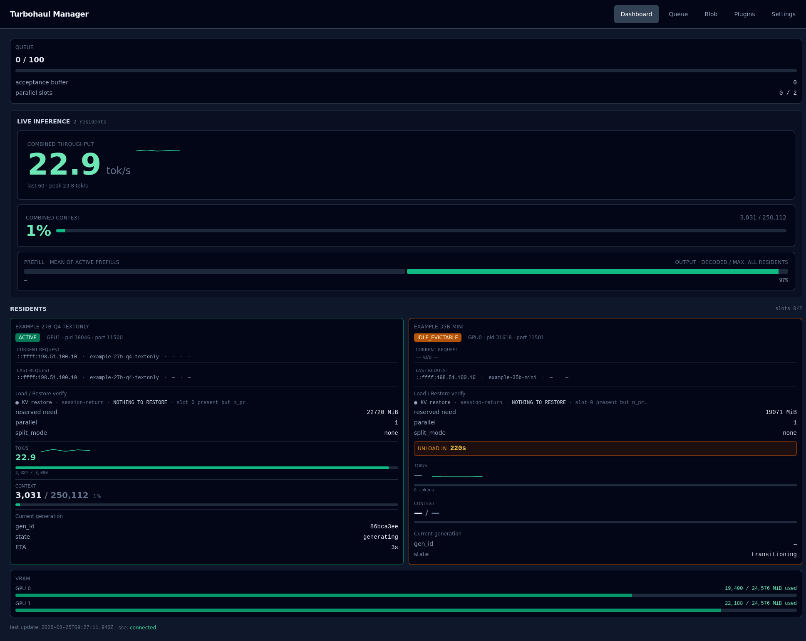
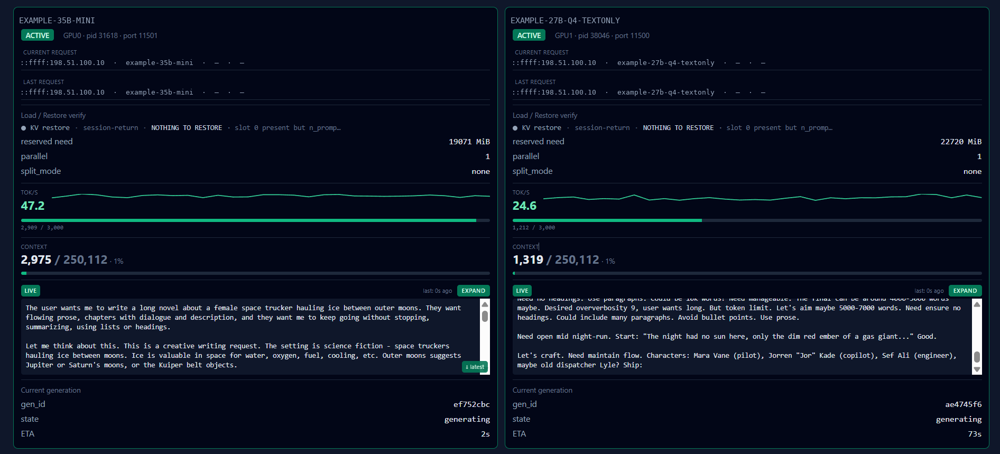

# Dashboard

The landing page, and the one to keep open while something is running. It answers four
questions at a glance: is anything queued, what is loaded, how fast is it going, and how much
GPU memory is left.

## Queue

The top card is the shortest summary in the interface. Its headline number is the total of
requests that are waiting, including requests held behind a busy model that never enter the
staging queue; it reads "not reported by this manager" if the server does not send that total.
Beneath it, `staging 0 / 100` is the staging queue against its depth limit (100 by default),
**acceptance buffer** counts requests that have arrived but are not yet staged, and
**parallel slots** shows how many engines are running out of how many may run at once.

If the waiting number climbs and stays there, work is arriving faster than it is being served.
That is a capacity signal, not an error.

## Live inference

**Combined throughput** is tokens per second across every loaded model, with a sparkline of
the last sixty samples and the peak in that window. **Combined context** is how full the
loaded models' context windows are in total.

The split bar beneath has two halves: **prefill** (the mean of the active prefills) is the model
reading your prompt, and **output** (decoded tokens against the maximum, across all residents) is
the model writing its answer. The prefill half shows a dash when nothing is prefilling. A prefill
bar that is filling while the output bar stays empty means the server is working through a
large prompt and has not started answering yet. That is the normal shape of a long-context
request, and it is the first thing to check on this page when a request feels slow.

## Residents

One card per loaded model. Each card is independent — its own throughput, its own context
meter, its own live output.

| Row | What it means |
|---|---|
| Status badge | The resident's state, for example **ACTIVE** while serving or **IDLE_EVICTABLE** once nothing is in flight. A countdown labelled **GRACE** or **UNLOAD IN** appears when the server reports one |
| Alarm badge | **STALLED**, **NO TELEMETRY**, **PREFILL HANG** or **BUSY** when the engine looks unresponsive; hover for the detail |
| GPU, pid, port | Which card it sits on, and the process behind it |
| **Current request** / **Last request** | Caller address, label, model, role, and session. **Current request** reads "idle" when nothing is running on that model; **Last request** persists after the request ends |
| **Load / Restore verify** | Whether a saved cache was restored on load, and what happened if not |
| **reserved need** | Memory this model reserved, which is not the size of its file |
| **parallel** / **split_mode** | How many slots it serves, and whether it spans more than one card |
| **LIVE** box | The response as it is generated |

### Live output

Each resident card carries its own live output box showing that model's response as it is
produced. The box appears once the stream has delivered a frame for that model and stays
visible while the model is resident — greyed when idle rather than vanishing, so it does not
disappear mid-glance. **Expand** (then **Retract**) switches between the compact and tall
heights, and a **↓ latest** control appears if you have scrolled up while output is still
arriving.

Above, two models are generating at once on separate cards — 47.2 and 24.6 tokens per second —
each showing its own stream. Every loaded model gets its own card, two per row on a wide screen
and one per row on a narrow one.

**What this page cannot tell you:** it shows the model each engine is serving, not which
conversation is waiting behind it. For that, use [Queue](02-queue.md).

## VRAM

Per-GPU usage, drawn as one bar per card below the resident cards, in MiB used out of the
total the server reports. When the server does not report per-GPU memory, the card says that VRAM
telemetry is unavailable instead of showing a number.

Worth knowing: a model's memory need is not its file size on disk — the estimate is the model
body plus the context cache plus overhead, so a large context window adds substantially to it.
See [SAFETY_GATE_VRAM_MATH.md](../SAFETY_GATE_VRAM_MATH.md) for the arithmetic.
