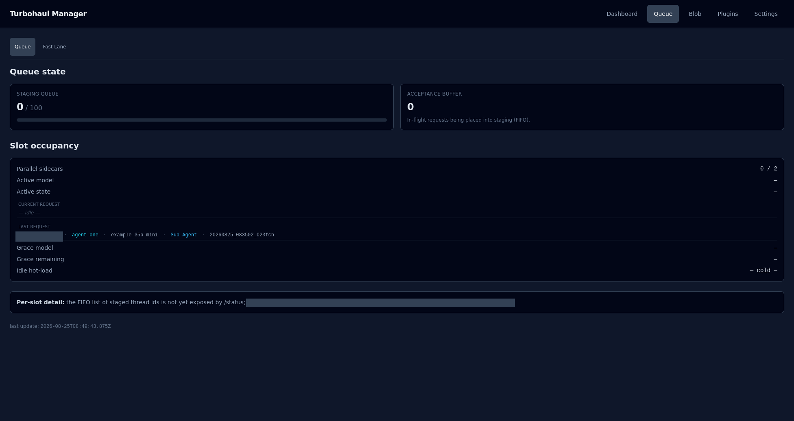

# Queue

What is waiting, what is being served, and how long a finished model will be held before it
is unloaded. The Queue tab has two sub-pages: **Queue**, described here, and
[Fast Lane](03-fast-lane.md).

## Queue state

**Staging queue** is the number of requests admitted and waiting, against the configured
depth (`queue.staging_queue_depth`, 100 by default). **Acceptance buffer** is the step before
that — in-flight requests being placed into staging. **Requests waiting** is the total,
including requests held behind a busy model, which never enter the staging queue.

A request normally spends only a short time in staging, so a zero there does not mean nothing
is waiting. Read **Requests waiting** for that; it shows a dash, and says so, if the server does
not report a total.

## Slot occupancy

**Parallel sidecars** is how many engines may run at once against how many are running.
**Active model** and **Active state** name what is being served and where it is in its
lifecycle.

**Current request** (above) and **Last request** carry the caller address, the label saved for
that address in Fast Lane if there is one, the model, the role the caller declared, and the
session id. **Current request** reads "idle" when nothing is running. The role matters more
than it looks: it sets the traffic class that [Fast Lane](03-fast-lane.md) ranks within an
address, and the class that selects the saved-cache bin a follow-up may reuse.

## Grace and idle

Two different timers, and they are easy to confuse.

**Grace** is a short window after a request finishes during which a follow-up on the same
conversation can reuse the still-warm engine (`queue.grace_seconds`, 30 seconds by default).
**Idle hot-load** is a longer window after grace expires during which the model stays loaded
even with nothing to do, because unloading and reloading costs more than waiting
(`queue.idle_hot_load_seconds`, 600 seconds by default).

The page shows them as **Grace model**, **Grace remaining** and **Idle hot-load**. Grace
remaining reads `Ns (ext x/y)` — seconds left and the extensions used out of the maximum — or
"held during serve — re-arms after turn" while a request is still being served. Idle hot-load
reads the model and its seconds left, or `— cold —` when no model is held by that window.

## Waiting requests

One row per request waiting in the staging queue or the acceptance buffer. The server caps the
list at 50 ordinary rows, and never drops a request that matched a Fast Lane rule. **Client** is
the Fast Lane label for the caller, or the start of its thread id when there is none. **Tag / rank**
is the Fast Lane rank when a rule matches, and a dash otherwise. **Status** reads "waiting for
a turn to complete", with the model that is likely to be unloaded for it when the server can
name one, and the request's state in brackets. The section says "Nothing waiting." when it is
empty.

## Fast Lane claims

A different population from the table above: requests that are deferring and have not yet
reached staging, so the Waiting requests table cannot see them. Each row shows the **Model**,
the **Client**, **Tag / rank**, the **Reason** it is deferring, and how long it has **Waited**.
The section says "No active claims." when it is empty.

## What this page cannot tell you

The Waiting requests table lists requests by client and rank; its rows carry no prompt or
response text. When the server does not report the waiting list or the claims list,
the page says so rather than showing an empty table. The footer shows when the page last
refreshed.
