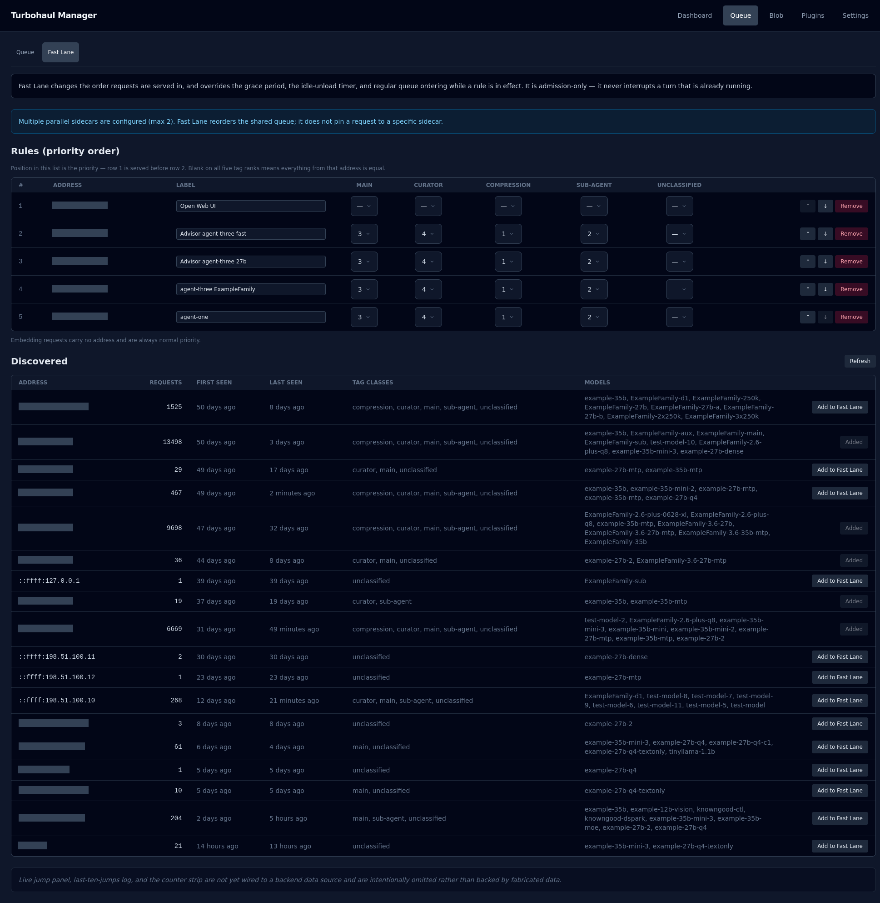

# Fast Lane

**Which Fast Lane doc do you want?** The architecture (how Fast Lane behaves, the specification) is [design/FAST_LANE_ARCHITECTURE.md](../design/FAST_LANE_ARCHITECTURE.md), the architecture doc for Fast Lane. Setup and day-to-day use: [FAST_LANE.md](../FAST_LANE.md). This page is the dashboard page.

Fast Lane changes the order requests are served in. It is the answer to "these two callers are
not equally important, and I want the server to know that."

## What it does, and what it does not

Fast Lane reorders the queue, and a higher-priority caller does not wait for a grace window or
an idle-unload countdown to run out: the hold ends at the next turn boundary so the caller does
not sit behind a warm model that is doing nothing. The page states the same thing in its header
note. [FAST_LANE.md](../FAST_LANE.md) has the full rules.

Fast Lane is off by default. Turn it on with **Enable Fast Lane request priority** under
Settings → General (see [Settings](07-settings-config.md)). While it is off, this page shows
"Fast Lane is off — switch it on in Settings" and its controls are dimmed. If the saved Fast Lane
settings were rejected when the server started, a red banner says so and gives the reason.

**It is priority admission plus turn-boundary unloads. It never interrupts a turn that is already
running.** A high-priority request that arrives mid-generation waits for that generation to finish;
it simply goes to the front of what happens next, and when the server is full an idle model may be
unloaded at a turn boundary to make room for it. (The page's own banner calls this "admission-only";
it means the same thing: nothing already running is cut.) If you are expecting pre-emption, this is
not that.

When more than one engine may run at once, the page says so at the top — Fast Lane reorders
the *shared* queue and does not pin a caller to a particular engine.

## Rules

Each row is one caller. A rule identifies its caller by **container name** (for a caller on the
container network) or by **address** (for a caller off it); the **Identity** column shows
whichever the rule uses. **Position is priority** — row 1 is served before row 2. The arrows
move a rule up or down; that is the only thing that changes precedence. There can be at most
10 rules, and an address rule names a single host, not a range.

Add a rule from the Discovered list below, or type a container name into the box above the
table and choose **Add by container name**. The **Label** column is your own note about the
rule. **Remove** deletes it. Every change except typing a label is saved as soon as you make
it; a label is saved when you leave the field.

The five columns are traffic classes: **Main**, **Curator**, **Compression**, **Sub-agent**,
and **Unclassified**. Each cell is a priority grade, from 1 to 5 or a dash for none, and a
lower number is served first. A grade ranks that class within that caller. Blank in all five
means everything from that caller is treated equally.

This is what lets you say "this caller first, and within it, compression work before
sub-agent work".

If the Discovered list shows more than one caller behind the address of a rule, that rule's row
warns that a rule on the address alone applies to every caller sharing it, and that different
callers cannot be told apart that way.

## Reading the table

A row with grades in some columns and dashes in others ranks the classes you filled in ahead of
the ones you left blank; classes left blank are equal to each other. A caller with no rule at all
is served after every request that matches a rule, in arrival order, but it is not starved: once
an unlisted request has waited longer than the anti-starvation wait (`fastlane.max_normal_wait_s`,
3600 seconds by default, editable under Settings → General) it is promoted ahead of listed work
for one turn. Embedding requests carry no address, so they always take normal priority.

## Discovered

The list of callers the server has seen: **Address**, **Name**, **Requests**, **First seen**
(hidden on narrow screens), **Last seen**, **Tag classes** and **Models**. **Add to Fast Lane**
creates a rule for that caller, using its container name if the list shows one, and the button
reads **Added** once a rule exists. **Refresh** reloads the list. Entries that no rule names are
dropped once they have not been seen for longer than `fastlane.census_ttl_hours` (168 hours by
default).

**Name** is the container name behind the address. It is looked up only to fill this column, and
shown only after a forward lookup of that name returns the same address; it never decides how a
request is matched. A dash means no name was confirmed.

## Warnings after saving

A save can succeed and still leave a rule that does not do what you meant. When the server
flags one, the page shows "Saved, but the manager flagged N problems with these rules" and
lists them. The checks cover: a container name or an address that appears in two rules (the
second can never match); an address rule for an address the list has never seen; a container
name that currently resolves to no address; an address rule that points at the same address as
a container-name rule; and an address rule that sits in the same container subnet as a
container-name rule, which suggests an address that can change when the container restarts.

## Counters

**Refusals by reason** is read from the server's status. **Served / jumped per class** and
**Fairness firings** read "not yet available", and the page notes that a live jump panel and a
log of recent jumps are not shown because there is no data source for them yet.

## What this page cannot tell you

It shows the rules, not their effect. To see whether a rule is doing what you intended, watch
the order requests are actually served in on [Queue](02-queue.md).
