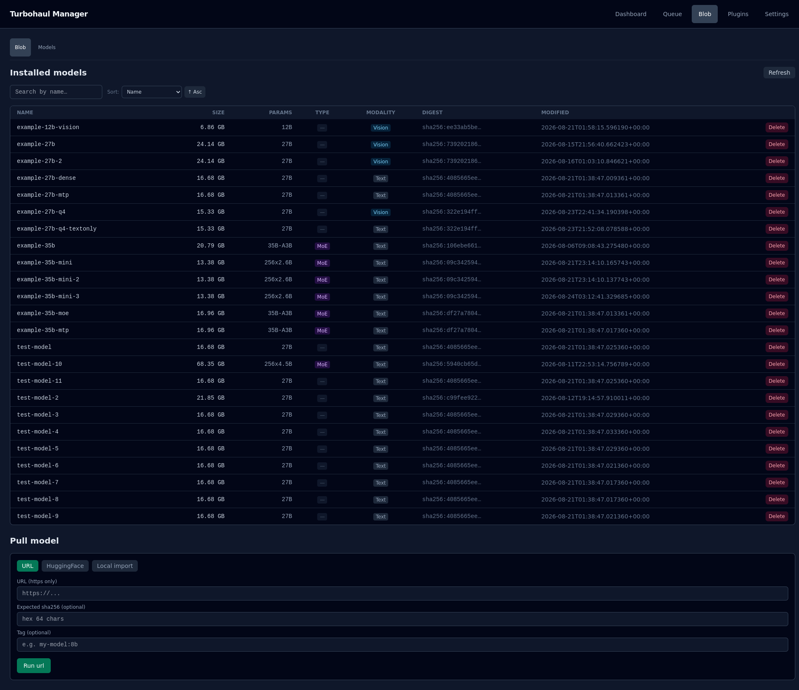

# Blob

Every model file the server has on disk, addressed by content rather than by filename. The Blob
tab has two sub-pages: **Blob**, described here, and [Models](05-models.md).

## What a blob is

A blob is the model file itself. It is stored under the hash of its contents, which has two
consequences worth understanding:

- **Two identical files are one blob.** Registering the same model under a second name does
  not use more disk.
- **A blob is not a model you can run.** It becomes runnable when a manifest points at it and
  supplies the settings — context size, placement, and so on. See [Models](05-models.md).

## The table

The **Installed models** table has one row per model manifest that is not hidden.

| Column | Notes |
|---|---|
| **Name** | The manifest name (the model tag), not the filename |
| **Size** | On disk. This is **not** the memory it will need — the context cache is charged on top |
| **Params** | Parameter count where the file declares it |
| **Type** | **Dense**, **MoE** (mixture-of-experts), or a dash when unknown |
| **Modality** | **Text**, **Vision**, or a dash when unknown |
| **Digest** | The start of the content hash — the blob's real identity |
| **Modified** | When the manifest file was last modified |

The search box filters rows by name. The **Sort** control orders them by Name, Size, Date loaded,
Parameters, Type or Modality, ascending or descending; rows with no value for the chosen key
sort last. **Refresh** reloads the list.

## Deleting

**Delete** asks for confirmation, and then **refuses if any manifest still points at the blob**,
and tells you which ones. That guard matters more than it sounds: a manifest counts whether it
names the blob as its model, as its vision projector, or as its speculative draft model, so a
file used only as a projector or draft model by *other* manifests cannot be deleted out from
under them. Because each row here is itself a manifest that names its blob, delete or re-point
the manifests first (on the [Models](05-models.md) page), then delete the blob. The server's
reply is shown under the table.

## Pull model

Below the table, **Pull model** brings a file into the store from one of three sources:

| Source | Fields |
|---|---|
| **URL** | An https URL, an optional expected sha256, and an optional tag |
| **HuggingFace** | A repo (`owner/repo`), a file in the repo, and an optional tag. The host must be on `pull.hf_host_allowlist` |
| **Local import** | An absolute path that must be under the configured import root, and an optional tag |

The button runs the selected source, and the server's HTTP status and reply appear below it.
The list refreshes after a successful pull.

## What this page cannot tell you

Size on disk is a poor predictor of whether a model will load. A small file with a very large
context window can need more memory than a larger file with a small one.
