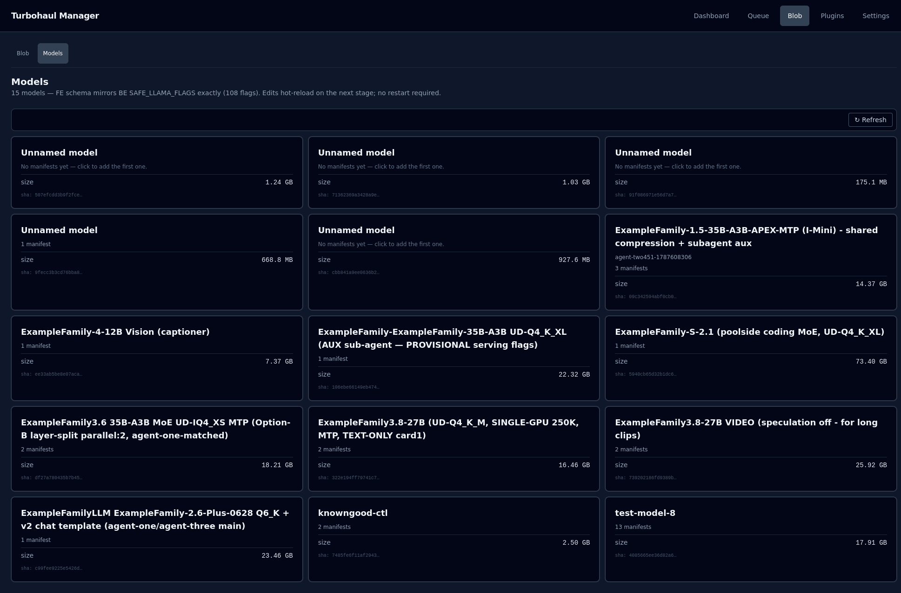

# Models

The model-first view, and the second sub-page of the Blob tab: one tile per model file, and the
manifests that configure it one click in.

## Tiles and manifests

Each tile is a blob and shows its display name, its description, how many manifests point at
it, its size and the start of its hash. Click a tile to open that model's page, which lists the
manifests pointing at that blob — the *configurations* of that model — and has **Back** and
**Refresh** controls. One file can back several manifests, which is how you run the same
weights with different context sizes, placement, or roles without a second copy on disk.

A tile reading **"No manifests yet — click to add the first one"** is a model file with no
configuration: present, but not runnable.

**"Unnamed model"** means none of the manifests for that file has a display name set. It is
cosmetic — the model still works — and a description can be added from the model's page with
**Edit description**.

On a model's page, **+ Add manifest** asks for a new tag and creates a manifest for that file.
Each manifest row shows its display name (or its tag), its revision, a visible or hidden
marker, and four buttons:

| Button | What it does |
|---|---|
| **Duplicate** | Creates a copy of the manifest, tagged `<tag>-copy` |
| **Rename** | Creates the manifest under the new tag and deletes the old one; callers using the old name get a 404 |
| **Hide** / **Show** | Hides the model from the discovery listings, or shows it again. A hidden model still serves requests that name it exactly |
| **Delete** | Deletes the manifest |

**Delete model** on the model's page deletes the file. When manifests point at it, it offers
**Delete blob + N manifests** or **Delete blob, keep manifests**; the server refuses the second
for as long as any manifest still names the file (see [Blob](04-blob.md)), so the first is the
one that succeeds.

## Editing

Clicking a manifest row opens the editor beneath that row, rather than at the top of the page,
so you keep your place in a long list. The editor has a display name, a description, and the
engine flags grouped by category, with the most-edited ones first. **Save manifest** writes
the change. **Restore defaults** clears the model's cache overrides back to the defaults, and
**Raw JSON** switches to editing the manifest as text. The raw mode skips the form but not the
server's validation.

The header of the Models page states the bar the form holds itself to: **the form mirrors the
server's own allow-list of engine flags exactly**. If a flag is not in that list, the server
will refuse it, and the form will not offer it. That is deliberate — the allow-list is a
security control, not a convenience.

**Edits take effect the next time the model is staged. No restart is required.**

## Descriptions

A model description is stored against the blob digest, not the manifest, so it survives
renaming or duplicating a manifest. It is the one shown on the tile and edited with **Edit
description**. A manifest description is stored against the manifest and is edited in the
manifest editor.

## What this page cannot tell you

It shows what is configured, not what will fit. A manifest can be perfectly valid and still be
refused at load time by the memory gates.

## See also

- [Models and manifests](../MODELS_AND_MANIFESTS.md): how to add and configure a model, from the backend and from this page.
- [Model configuration reference](../MODEL_CONFIG_REFERENCE.md): every manifest field and flag.
