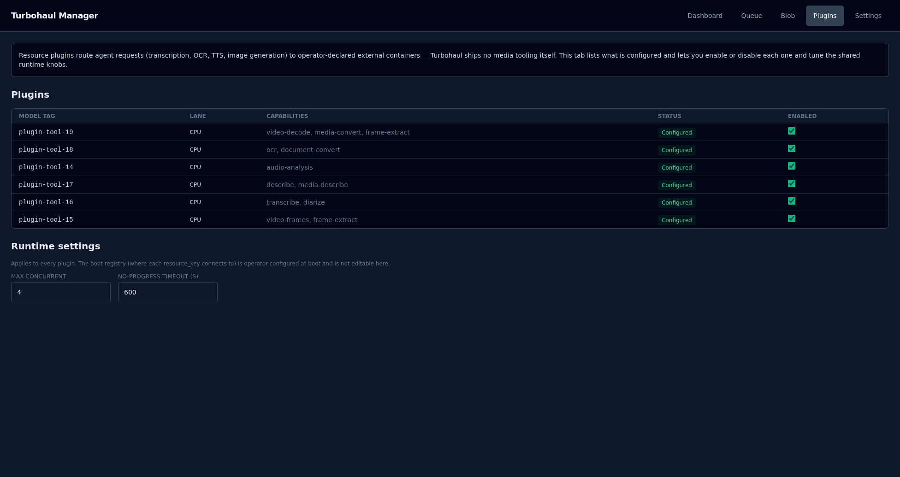

# Plugins

Plugins are how an agent reaches tools the manager does not contain — transcription, OCR,
text-to-speech, image generation.

**Status:** work in progress — feedback and contributions welcome. The tab is labelled **Plugins (WIP)** in the navigation, and the
page opens with a banner reading "Work in progress — feedback and contributions welcome".
Parts of it are not wired up yet; those are called out below.

## The important thing first

**Turbohaul ships no media tooling itself.** A plugin is a route to a container you run and
declare. Nothing on this page installs anything.

An agent addresses a plugin the same way it addresses a model — **by tag**. It never names a
host, a port, or a URL. The manager resolves the tag to a destination from a registry set at
boot, and that registry cannot be changed through the web interface or the config API: the
server rejects a change to it. That is what stops a request from being pointed at somewhere it
should not go. See [PLUGINS_SETUP.md](../PLUGINS_SETUP.md) to declare one and
[PLUGIN_REFERENCE.md](../PLUGIN_REFERENCE.md) for the details.

When no plugin is configured, the page says so and explains how to add one: declare a registry
entry (host, port, health check) at boot, and save a plugin manifest whose `resource_key` names
it. Plugins whose manifest is marked hidden are not listed.

## The table

| Column | Meaning |
|---|---|
| **Model tag** | How agents address this plugin |
| **Lane** | The lane the manifest declares, CPU or GPU. It is descriptive: the manager only reports it |
| **Capabilities** | The free-text list the manifest declares — `transcribe`, `ocr`, `frame-extract`, and so on |
| **Status** | **`Configured`**, or **`Not configured yet`** when the plugin's key has no usable registry entry |
| **Enabled** | A checkbox, on by default, saved as soon as you change it. See the note below |

**The Enabled checkbox is not enforced yet.** The setting is stored and shown, but nothing in
the server reads it: a plugin you switch off here can still be called by its tag. Deleting the
plugin's manifest is what makes it uncallable.

**`Configured` does not mean reachable.** It means the plugin's key resolves in the boot
registry and the address is allowed. The page deliberately does not probe the container.
Reachability is established by actually calling it — a status light that goes green on a ping
would tell you the container answers pings, not that it works.

## Runtime settings

**Max concurrent** (4 by default) is meant to cap plugin calls in flight across all plugins,
but like the Enabled checkbox it is stored and not yet enforced. **No-progress timeout (s)**
(600 by default) is how long a call may go without a byte sent or received before it is
abandoned — a stalled transcription returns an error (HTTP 504, reason `no_progress`) instead
of waiting forever. A value of 0 means the call times out immediately, not that the timeout is
off. The timeout is read on every call, so a change takes effect without a restart.

Both settings are shared by every plugin and save when you leave the field; a value outside the
server's bounds is refused with a message. The boot registry is not editable here, by design.

**See also:** [MEDIA_HOOK.md](../MEDIA_HOOK.md) — why the hook exists and what its two lanes are for; [VISION_MODELS.md](../VISION_MODELS.md) — serving a vision model with its multimodal projector. A vision model reads images as input; it is not a plugin.
