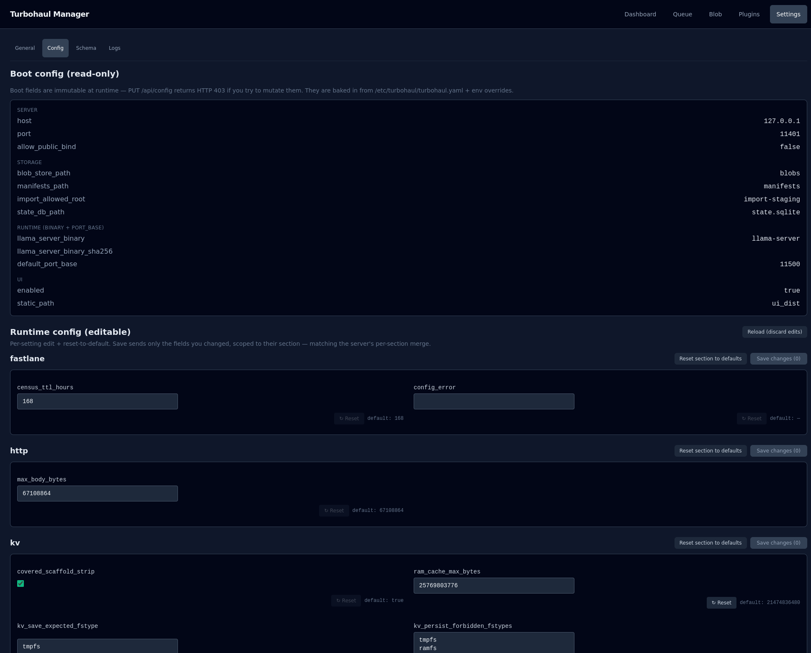

# Settings · General and Config

The Settings tab has four sub-pages: **General** (the first one, covered at the end of this
page), **Config**, [Schema](08-settings-schema.md) and [Logs](09-settings-logs.md). Config shows
every setting the server is running with, split into what you can change now and what needs a
restart.

**Settings docs:**

- General and Config (this page) — every setting the server is running with, split into what you can change now and what needs a restart.
- [Schema](08-settings-schema.md) — a builder for the response_format envelope, so you can constrain what a model returns.
- [Logs](09-settings-logs.md) — the audit trail: what the server did, in order, with filters.
- [Model configuration reference](../MODEL_CONFIG_REFERENCE.md) — every setting you can put in a per-model manifest.

*This page is long — the crop above is the top of it. [The full screen](img/07-settings-config.png) shows every section at once.*

## Boot config (read-only)

The top block is fixed until the process restarts: bind address and port, storage paths, the
engine binary, and the interface itself. **Attempting to change these through the API returns
403.** They are shown so you can confirm what the server actually loaded.

Filesystem paths are shown as basenames rather than full paths. That is intentional.

## Runtime config (editable)

Everything below is changeable while the server runs. Each section saves independently, and
**only the fields you actually changed are sent** — so two people editing different sections do
not overwrite each other. The server writes saved changes to a runtime override file and
applies them again at the next start.

Every field shows its default next to it, with a **Reset** control, and each section has
**Reset section to defaults**, which stages every field in that section back to its default and
still needs a save. A field already at its default has its Reset control disabled. The **Save
changes** button carries a count, so you can see how many edits are pending before you commit
them. A **Raw JSON** disclosure at the bottom shows the same values as text.

The sections are: **fastlane**, **http**, **kv**, **monitor**, **persist**, **plugin_runtime**,
**plugins**, **pull** and **queue**. Two of them are partly or wholly not editable here:
**plugins** is a boot-only section that lists only the names of the registered plugins, and the
server rejects changes to it. The fields of **fastlane** and **persist** that have their own
controls on the General page (and the Fast Lane tab's rules) are left out of their sections.

## The ones worth knowing

| Setting | Why it matters |
|---|---|
| `queue.max_parallel_sidecars` | How many engines may run at once (1 by default) |
| `queue.grace_seconds` / `idle_hot_load_seconds` | The two warm-hold windows (30 and 600 seconds by default) — see [Queue](02-queue.md) |
| `queue.safety_*` | The memory, CPU and I/O gates that refuse a spawn rather than risk the host |
| `kv.ram_cache_max_bytes` | Byte ceiling on the RAM-tier KV-cache save directory (20 GiB by default; 0 disables the ceiling) |
| `http.max_body_bytes` | Request size limit (64 MiB by default). Raise it if you send inline images or audio |
| `pull.hf_host_allowlist` | The hosts the HuggingFace pull may fetch from |

**Known issue:** `plugin_runtime.enabled` displays as `[object Object]` and cannot be edited
here — it is a per-plugin map rather than a single value. The per-plugin switch is on the
[Plugins](06-plugins.md) tab, which is a work in progress.

## Reload

**Reload (discard edits)** re-reads from the server and throws away anything unsaved. It is the
way back if you have made a mess of a section and would rather start again.

## The General page

The first Settings sub-page holds the settings that have their own controls rather than a
generic field.

| Section | What it holds |
|---|---|
| **About** | The manager's version, backend, whether the backend build is pinned, the API compatibility level and the user-agent string |
| **Persist KV Cache (SSD)** | The maximum SSD footprint for persisted KV caches, in GiB (`persist.max_bytes`, 40 GiB by default; 0 removes the ceiling, and age and count clean-up still run). It also shows the configured cap, current usage and headroom, and flags **OVER CAP** |
| **KV Cache Behavior** | **Strip reasoning scaffold from saved KV cache** (`kv.covered_scaffold_strip`, on by default), so a saved cache matches what the client re-sends on the next turn |
| **Fast Lane** | **Enable Fast Lane request priority**, the **anti-starvation wait** (`fastlane.max_normal_wait_s`) and the **cross-model switch rate** (`fastlane.cross_model_switches_per_min`), with the related `queue` values shown read-only and a link to edit them under Config. Rules are managed under Queue → [Fast Lane](03-fast-lane.md) |
| **Licenses + attribution** | The license notice and where the third-party licenses are |

Each section has its own **Save**. If the current settings could not be loaded, the Fast Lane
controls are disabled, so a save cannot overwrite settings the page never read.
