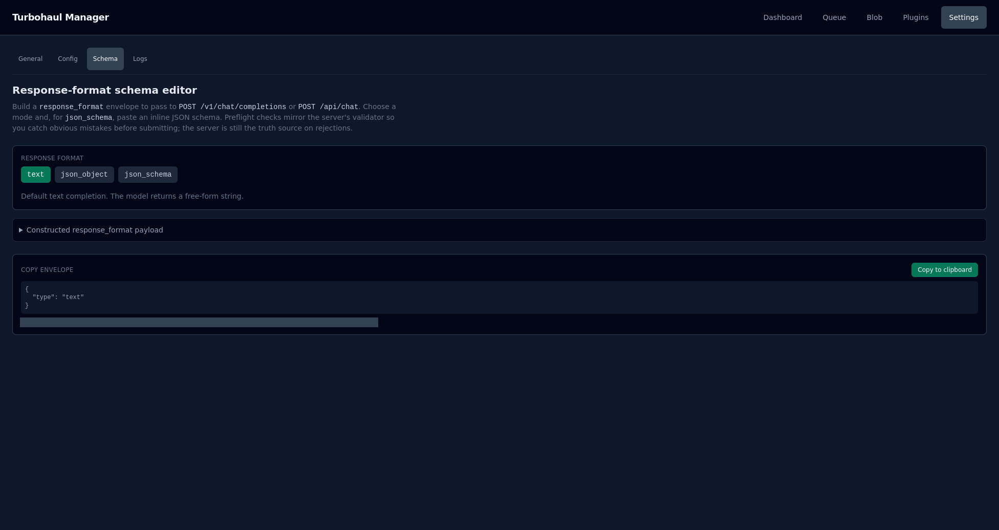

# Settings · Schema

A builder for the `response_format` envelope, so you can constrain what a model returns.

**Settings docs:**

- [General and Config](07-settings-config.md) — every setting the server is running with, split into what you can change now and what needs a restart.
- Schema (this page) — a builder for the response_format envelope, so you can constrain what a model returns.
- [Logs](09-settings-logs.md) — the audit trail: what the server did, in order, with filters.
- [Model configuration reference](../MODEL_CONFIG_REFERENCE.md) — every setting you can put in a per-model manifest.

## What it is for

Some models return free-form prose when you wanted structured data. `response_format` tells the
server to constrain the output. This page builds that envelope correctly so you can paste it
into a request.

## The three modes

| Mode | What the model returns |
|---|---|
| **text** | Free-form. The default |
| **json_object** | A JSON object on a best-effort basis: the server hints the model to return one, and no schema validation runs |
| **json_schema** | JSON shaped by a schema you supply |

For **json_schema**, give the envelope a **Name** (required) and paste the schema inline into the
**Schema (JSON)** box, which starts with a small example; the page assembles the full envelope
around it.

## Preflight

The page validates before you send, using checks that mirror the server's own validator, so
obvious mistakes surface here instead of as a rejected request. For a **json_schema** envelope
it reports a JSON syntax error, or a schema that is larger than 65,536 bytes when serialized,
nested deeper than 16 levels, or has more than 64 properties in total. It also rejects a schema
that uses `$ref` (inline the referenced subschema instead) and any `type: "object"` subschema
that does not set `additionalProperties: false`. A passing schema shows "Preflight passed".

**The server remains the authority.** These checks catch common errors; they are not a
guarantee of acceptance. If the two disagree, the server is right.

## Copying

The **Copy envelope** box shows the constructed payload, and **Copy to clipboard** puts it on the
clipboard, ready to drop into a `POST /v1/chat/completions` or `POST /api/chat` body. The button
is disabled while the schema fails preflight. The same payload is also under **Constructed
response_format payload** in the editor.

## What this page cannot do

**It does not send anything.** It is an author-only tool — build the envelope here, send it
from your own client. Live posting and retry-on-noncompliance are not implemented, and the page
says so rather than leaving you to discover it.
