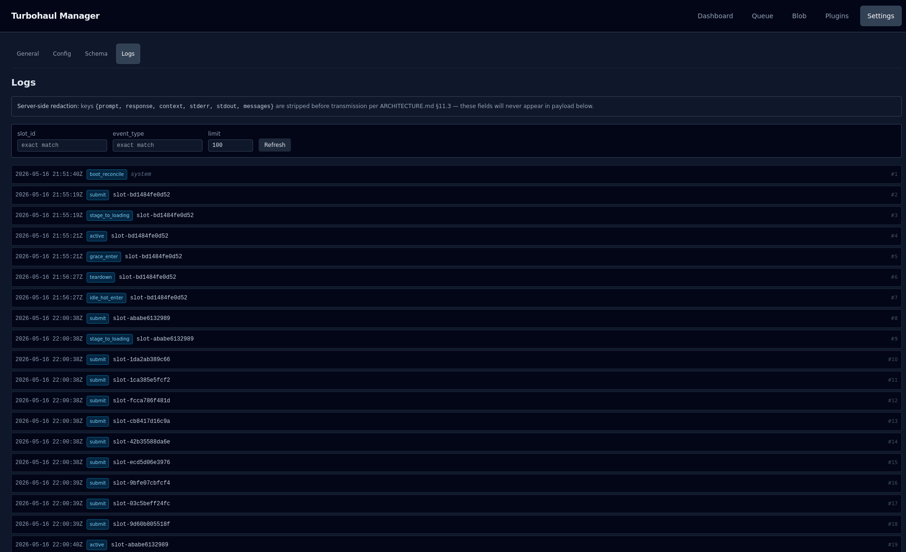

# Settings · Logs

The audit trail: what the server did, in order, with filters.

**Settings docs:**

- [General and Config](07-settings-config.md) — every setting the server is running with, split into what you can change now and what needs a restart.
- [Schema](08-settings-schema.md) — a builder for the response_format envelope, so you can constrain what a model returns.
- Logs (this page) — the audit trail: what the server did, in order, with filters.
- [Model configuration reference](../MODEL_CONFIG_REFERENCE.md) — every setting you can put in a per-model manifest.

*The page continues for as many rows as the limit allows — [the full screen](img/09-settings-logs.png) shows all 100.*

## Read the banner first

> Server-side redaction: keys `{prompt, response, context, stderr, stdout, messages}` are
> stripped before transmission … — these fields will never appear in payload below.

That is not a display filter. **The stripping happens on the server, before the data is sent to
your browser**, and it applies through nested objects and lists, down to a fixed depth. The
server's list of stripped keys is a little longer than the banner's: it also removes
`thread_id`, `ip`, `client_meta` and `idle_client_meta`. The stripping is a backstop; the
primary protection is that the manager does not put prompts or responses into audit events in
the first place. See the redaction notes in [ARCHITECTURE.md](../../ARCHITECTURE.md).

## What each row shows

Each row shows the timestamp (UTC), the event type, the slot the event belongs to (or "system"
when it belongs to none) and the event's sequence number. Click a row to expand its payload as
JSON. The event types include these, which trace a request's life:

| Event | Meaning |
|---|---|
| `submit` | Request accepted |
| `stage_to_loading` | Queued and now loading a model |
| `active` | Being served |
| `grace_enter` | Finished; the model is held briefly for a follow-up |
| `idle_hot_enter` | Grace expired; still held, now on the longer idle timer |
| `teardown` | Model unloaded |
| `boot_reconcile` | The server reconciling its state at startup |

Following one slot id down the page shows the events recorded for that request, oldest first.

## Filtering

**Slot id** and **event type** are exact-match. **Limit** caps how many rows come back in one
page (1 to 500; the page starts at 100). The list starts at the oldest event and **Load more**
pages forward to newer ones; the page keeps at most the latest 2,000 rows (older ones drop off), so
narrow the filters and **Refresh** to reach them. If one event is larger than the page's size budget, the page says so.

A useful pattern: filter by one slot id to follow a single request, or by one event type to see
how often something happens across all requests.

## What this page cannot tell you

It records what happened, not why a model was slow. Timing lives on the
[Dashboard](01-dashboard.md). And because prompts and responses are stripped, this is not the
place to find what a model was asked — by design.
